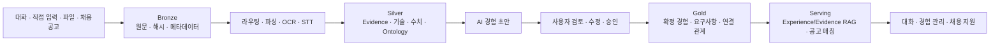

# Career Memory

> 대화와 다양한 첨부 원본에 흩어진 커리어 경험을 보존하고, LLM이 만든 초안을 사용자가 검토·승인한 뒤 재검색 가능한 커리어 지식으로 축적하는 개인 AI 서비스

**AI 서비스 기획 · LLM 애플리케이션 개발 · RAG/데이터 아키텍처 · Backend/Frontend 통합**

`React` · `FastAPI` · `LangChain/LangGraph` · `OpenAI/Gemini` · `ChromaDB` · `SQLite`

[GitHub Repository](https://github.com/hamhj7694/CareerMemory_langchain_rag) · [상세 벤치마크](AI_Engine/benchmarks/RESULTS.md) · [AI 데이터 아키텍처](docs/AI_DATA_ARCHITECTURE.md)


[프로젝트 요약](#프로젝트-요약) · [핵심 성과](#핵심-성과) · [개선 구조](#문제를-발견하고-바꾼-구조) · [아키텍처](#아키텍처) · [주요 기능](#주요-기능) · [품질 검증](#품질-검증) · [로컬 실행](#로컬-실행)

## 프로젝트 요약

Career Memory는 자기소개서를 한 번 생성하는 도구보다 **사용자의 경험을 근거와 함께 기억하는 시스템**에 초점을 맞췄습니다.

```text
대화·파일·채용공고 원문
  → 근거 추출·기술/수치 정규화
  → AI 경험 초안
  → 사용자 검토·수정·승인
  → 확정 커리어 지식
  → RAG 검색·채용공고 매칭·재활용
```

핵심 설계 원칙은 다음과 같습니다.

- 사용자 원문은 AI 분석 결과와 무관하게 보존합니다.
- AI 출력은 사실이 아니라 검증·재생성 가능한 파생 데이터로 취급합니다.
- 확정 경험은 `source ID`와 `exact quote`를 통해 원본까지 추적합니다.
- 임베딩은 후보 검색에 사용하고, 명시적인 기술·수치 조건의 최종 판정은 규칙과 근거로 수행합니다.
- AI가 만든 초안은 사용자가 승인한 뒤에만 정식 경험이 됩니다.

## 핵심 성과

동일한 38개 사용자 메시지를 `gpt-4o-mini`로 콜드 1회·반복 3회 실행한 중앙값입니다. 최종 비교 대상은 기술·수치 projection과 원문 검증까지 포함한 `structured v3`입니다.

### 성능과 비용

| KPI | 기존 통합 분석 | 구조화 라우팅 v3 | 변화 |
|---|---:|---:|---:|
| 입력 토큰/회 | 8,533.5 | 7,494.0 | **-12.18%** |
| 출력 토큰/회 | 255.0 | 147.0 | **-42.35%** |
| LLM 호출/회 | 7회 | 2회 | **-71.43%** |
| 예상 비용/회 | $0.00143265 | $0.00123195 | **-14.01%** |
| 전체 처리시간 | 13.151초 | 4.564초 | **-65.30%** |
| 비의도 DB 쓰기 | 0/4 | 0/4 | **모두 안전** |

### 정답 세트 품질

| 품질 지표 | 기존 | 개선 후 |
|---|---:|---:|
| 경험 사실 재현율 | 66.667% | **100%** |
| 문맥 의존 사실 재현율 | 0% | **100%** |
| 공고 요구사항 재현율 | 50% | **100%** |
| 정확 인용 유효성 | 100% | **100% 유지** |
| 기술 정규화 재현율 | - | **100%** |
| 구조화 수치 재현율 | - | **100%** |
| AI 답변 오염률 | 0% | **0%** |
| 무관 대화 누출률 | 0% | **0%** |
| 수치 환각률 | - | **0%** |

작은 정답 세트에서는 문맥과 인용 검증을 강화한 만큼 비용이 증가할 수 있었습니다. 반면 실제 긴 대화에서는 중복 공고 탐색과 불필요한 LLM 호출을 제거해 **품질을 높이면서 토큰·비용·시간을 함께 줄였습니다.** 입력 fixture가 다른 ontology/Evidence v4는 성능 수치를 직접 비교하지 않고, 이전 정답 세트 품질이 유지되는지 검증하는 용도로 사용했습니다.

측정 조건과 raw report 목록은 [Conversation Analysis Benchmark Results](AI_Engine/benchmarks/RESULTS.md)에서 확인할 수 있습니다.

## 문제를 발견하고 바꾼 구조

| 발견한 문제 | 기존 상태 | 개선한 구조 |
|---|---|---|
| 분석 비용과 공고 오탐 | 경험·공고 분석기가 긴 대화를 반복 탐색하고 단일 자격요건도 공고로 오인 | Function Calling 기반 **통합 콘텐츠 라우터**와 완전한 공고 guard로 필요한 분석만 실행 |
| 기술명 혼동 | 임베딩 유사도가 높으면 FastAPI/REST API, JavaScript/TypeScript가 동일하게 취급될 위험 | canonical concept·alias·related 관계를 분리하고 **검색 후보와 최종 충족 판정**을 구분 |
| 수치 환각 | LLM이 제안한 숫자를 그대로 저장하면 49%/50%, 최소/이하/범위가 섞일 수 있음 | exact quote에서 값·단위·연산자·범위를 다시 파싱하고 불일치 값은 거부 |
| 규격 밖 데이터 손실 | 정해진 기술 ID나 스키마에 없는 표현이 누락될 가능성 | raw 원문은 유지하고 미등록 표현을 `unresolved`로 보존한 뒤 검증된 projection만 추가 |
| 근거 추적 한계 | 실행 중 만든 source reference 중심이라 재분석·버전 추적이 제한적 | `EvidenceDocument`·`Chunk`·`Citation`·`EmbeddingRecord`를 영속화하고 원본까지 lineage 연결 |
| 첨부 처리 복구 | DB BLOB과 동기 파싱 의존으로 서버 중단·재시도에 취약 | `LocalBlobStore` 원본 우선 저장 + lease 기반 영속 작업 큐 + 상태·재시도 구조 |
| 채팅 대기 UX | AI 답변 생성 중 다음 메시지를 보내기 어려움 | 새 입력 시 기존 생성을 중단하고 연속 입력을 하나의 최신 문맥으로 결합 |

## 아키텍처



### 계층형 데이터 구조

| 계층 | 포함 데이터 | 책임 |
|---|---|---|
| **Bronze** | 대화, 직접 입력, 채용공고, 첨부 원본과 SHA-256 | AI 분석으로 덮어쓰지 않는 source of truth |
| **Silver** | 추출 텍스트, Evidence, SkillMention, QuantifiedMetric, Ontology, EmbeddingRecord | 원본과 버전으로 다시 만들 수 있는 분석·정규화 데이터 |
| **Gold** | 사용자가 승인한 Experience, JobRequirement, 연결 관계 | 제품이 신뢰하는 확정 커리어 지식 |
| **Serving** | 사용자별 Chroma, 공고 매칭, 챗봇 RAG 문맥 | DB와 원본에서 재구축 가능한 검색·제공 계층 |

현재는 대규모 데이터 레이크나 범용 그래프 DB를 도입한 구조가 아닙니다. SQLite·SQLAlchemy·LocalBlobStore·Chroma 안에서 **계층, lineage, 버전, 재처리라는 데이터 레이크의 핵심 원칙을 점진적으로 적용**했습니다.

## LLM·NLU 파이프라인

### 1. 콘텐츠 라우팅

- 사용자 입력을 `경험 / 공고 / 혼합 / 무관 / 불확실`로 분류합니다.
- OpenAI strict Function Calling과 Pydantic으로 결과를 검증합니다.
- 공고 전체가 아닌 단일 요구사항 문장은 공고 분석 대상으로 저장하지 않습니다.
- 필요한 분석기만 호출해 중복 탐색을 줄입니다.

### 2. 경험 구조화

- 한 번의 긴 입력에서 여러 경험을 분리합니다.
- 상황·행동·결과·역할·역량을 구조화된 초안으로 반환합니다.
- 사용자가 짧게 답했을 때 직전 AI 질문은 문맥으로만 사용합니다.
- AI 답변 자체는 사용자 경험을 증명하는 근거로 사용하지 않습니다.

### 3. 검증과 재시도

```text
Prompt
  → Structured Output
  → Pydantic Schema 검증
  → source ID·exact quote·허용 후보 검증
  → 제한적 Retry / 명시적 실패
  → 사용자 승인
```

JSON 형식이 맞는 것과 사실이 맞는 것은 다른 문제로 보았습니다. Schema가 유효해도 인용문이 원문에 없거나 ID가 허용된 후보 밖에 있으면 결과를 그대로 저장하지 않습니다.

## 경량 커리어 온톨로지와 수치 검증

### 기술 관계

| 관계 | 의미 | 필수 기술 충족 |
|---|---|---:|
| canonical ID 동일 | 같은 표준 개념 | O |
| `alias_of` | 같은 개념의 다른 표기 | O |
| `related_to` | 관련 있지만 다른 기술 | X |
| `broader_than` / `narrower_than` | 상위·하위 관계 | 명시적 정책이 있을 때만 |
| `unresolved` | 아직 연결되지 않은 원문 | X, 원문은 보존 |

예를 들어 `페스트API`는 `FastAPI`의 별칭으로 정규화할 수 있지만, `FastAPI`와 `REST API`, `JavaScript`와 `TypeScript`는 검색 후보를 넓힐 수 있을 뿐 동일 기술로 판정하지 않습니다.

### 수치 검증

- `49%`와 `50%`를 별개의 값으로 보존합니다.
- `약 50%`, `절반`, `두 배`, `최소 3년`, `3년 이하`, `3~5년`의 값·단위·연산자·범위를 구조화합니다.
- LLM이 제안한 숫자보다 exact quote에서 다시 파싱한 값을 우선합니다.
- 연도처럼 성과 수치가 아닌 숫자는 별도 규칙으로 제외합니다.

표준 ID와 스키마는 원문을 대체하는 강제 규격이 아니라, 검증될 때만 덧붙는 **선택적 projection**입니다.

## 주요 기능

### 커리어 챗

- 대화 세션 생성·검색·수정·삭제와 SSE 스트리밍
- 대화 요약 + 최근 원문 + 첨부 문맥 + Experience/Evidence RAG 조립
- AI 답변 중 추가 메시지 입력과 기존 생성 취소·문맥 통합
- SSE heartbeat와 동일 `client_request_id` 기반 snapshot 재연결
- 사용자 말풍선 텍스트 선택·복사와 사용자 친화적 오류 안내

### 경험 관리

- 대화·직접 입력·파일에서 0개 이상의 경험 초안 추출
- `경험 분류 → 프로젝트·활동 → 상세 경험` 구조
- 요약·상황·행동·결과·역할·역량·원본 근거 관리
- 초안 개별/전체 저장, 수정, 구조 편집, 휴지통
- AI 초안과 사용자 승인 경험의 상태 분리

### 채용공고 분석

- 공고 원문을 필수·우대 요구사항 카드로 구조화
- 요구사항별 확정 경험 RAG 검색
- Retriever가 준 후보 집합 안에서만 LLM 매칭
- AI 추천 연결과 사용자 직접 연결을 구분
- 원문에 없는 요구사항 인용과 후보 밖 경험 추천 차단

### 인증과 사용자 격리

- Argon2id 비밀번호 해시와 HttpOnly 세션 쿠키
- 가입·계정 관리에서 복구 질문 1개 설정
- 비밀번호 찾기에서는 저장된 질문 하나만 표시
- DB·첨부 원본·Evidence·vector를 인증된 `user_id` 범위로 격리

## 첨부·OCR·문서·미디어 처리

채팅·경험·공고의 파일 진입점은 모두 `AttachmentService`를 사용합니다. `+` 선택, `Ctrl+V` 붙여넣기, 드래그앤드롭을 같은 파이프라인에 연결하며 한 메시지에 최대 10개까지 첨부할 수 있습니다.

| 종류 | 형식 | 처리 방식 |
|---|---|---|
| 텍스트 | TXT, MD, Markdown | 인코딩 판별 후 줄 위치와 함께 추출 |
| PDF | PDF | 페이지별 native text 우선, 필요한 페이지만 OCR |
| 이미지 | PNG, JPEG, WebP, GIF, BMP, TIFF | Tesseract 다중 PSM·회전·대비·확대 전처리 |
| 문서 | DOCX, PPTX, HWPX | 문단·표·슬라이드·section 구조와 위치 보존 |
| 레거시 문서 | DOC, PPT, HWP | 외부 변환기가 있을 때 격리 변환 후 기존 파서 사용 |
| 음성·영상 | WAV, MP3, M4A, OGG, FLAC, MP4, MOV, WebM 등 | FFmpeg 정규화 후 STT 구간 start/end ms 저장 |

유효한 파일은 파싱 전에 `LocalBlobStore`에 원본과 SHA-256을 저장합니다. 파싱에 실패해도 원본·오류·파서 버전은 남습니다.

```text
queued → processing → ready
                    → partial
                    → failed
                    → unsupported
```

worker lease가 만료되면 작업을 다시 `queued`로 복구하므로 서버 중단 후에도 재처리할 수 있습니다. Tesseract·LibreOffice·한컴 변환기·FFmpeg·STT API가 없는 환경에서는 원문을 추정하지 않고 명확한 capability 오류를 반환합니다.

## RAG와 증분 인덱싱

검색 목적을 두 계층으로 분리했습니다.

1. **Experience RAG** — 사용자가 승인한 경험을 대화와 공고 매칭에 활용
2. **Evidence RAG** — 대화·파일 원문 chunk를 검색해 출처 확인과 재구조화에 활용

Chroma는 원본 저장소가 아닙니다. `content_hash`, provider, model, dimensions, index version을 `EmbeddingRecord`에 기록하고 변경된 대상만 재임베딩합니다.

- 동일 입력 반복: 임베딩 쓰기 0회
- 원문 변경: 이전 Evidence와 embedding을 stale 처리
- 연결 해제·삭제: stale vector 제거
- 인덱스 손상·삭제: DB와 Evidence에서 전체 재구축
- 백필·마이그레이션: 기본 dry-run, 명시적인 `--apply`에서만 변경

## 품질 검증

### 파일·데이터 계층

| 검증 항목 | 결과 |
|---|---:|
| 결정론적 문서 파서 | **5/5 성공** |
| 필수 문구·수치 재현율 | **100% / 100%** |
| 실제 한글 OCR 필수 문구·수치 재현율 | **100% / 100%** |
| 실제 한글 OCR CER | **8.333%** |
| 첨부 원본·SHA-256·완료 작업 | **10/10 · 10/10 · 10/10** |
| 만료 worker lease 복구 | **1/1** |
| concept·relation·unresolved·lineage 정확도 | **각 100%** |
| 반복 무변경 임베딩 쓰기 | **0회** |

### 회귀 테스트

- Backend: **223 tests passed**
- Frontend: **119 tests passed**
- 격리 SQLite·BlobStore·vector 기반 `/chat` Playwright E2E
- 저장된 복구 질문 조회 → 비밀번호 재설정 → 새 비밀번호 로그인 E2E
- Frontend production build, ESLint, `git diff --check` 통과
- 실제 모델 벤치마크 4회 모두 비의도 DB 쓰기 없음

테스트 수는 2026년 10월 9일 최신 작업 기준입니다. 벤치마크의 상세 조건과 서로 직접 비교할 수 없는 fixture는 [RESULTS.md](AI_Engine/benchmarks/RESULTS.md)에 구분해 기록했습니다.

## 기술 스택

| 영역 | 기술 | 프로젝트에서의 역할 |
|---|---|---|
| LLM / Agent | OpenAI, Gemini, LangChain, LangGraph | 대화, 라우팅, 경험 구조화, 요약, 공고 분석 |
| Structured AI | Function Calling, JSON Schema, Pydantic | AI 출력을 API·DB에서 사용할 수 있는 계약으로 검증 |
| RAG / Knowledge | ChromaDB, Embeddings, OntologyRepository | 경험·Evidence 검색과 기술 관계 판정 |
| Backend | FastAPI, SQLAlchemy, SQLite, SSE | 인증, 저장, 스트리밍, 데이터 소유권 검사 |
| File AI | PyMuPDF, Pillow, Tesseract, FFmpeg, OpenAI STT | 문서·이미지·음성·영상에서 근거 추출 |
| Frontend | React, Vite, react-markdown | 대화, 경험 검토·승인, 공고 매칭 UX |
| QA | unittest, Vitest, Playwright | 단위·통합·브라우저 회귀 테스트 |

기본 LLM은 `gpt-4o-mini`, 기본 임베딩 모델은 `text-embedding-3-small`입니다. `AI_PROVIDER`로 OpenAI와 Gemini 경로를 선택할 수 있습니다.

## 로컬 실행

### 1. 설치

```powershell
git clone https://github.com/hamhj7694/CareerMemory_langchain_rag.git
cd CareerMemory_langchain_rag

python -m venv .venv
.\.venv\Scripts\Activate.ps1
pip install -r requirements.txt

npm install
Copy-Item .env.example .env
```

`.env`에 선택한 provider의 API 키를 입력합니다.

```dotenv
AI_PROVIDER=openai
OPENAI_API_KEY=your-api-key
```

실제 키가 포함된 `.env`는 Git에 커밋하지 않습니다. 전체 설정과 선택적 OCR·변환·STT 경로는 [.env.example](.env.example)을 참고하세요.

### 2. 서버 실행

백엔드와 프론트엔드는 서로 다른 PowerShell 터미널에서 실행합니다.

```powershell
# 터미널 1: FastAPI
python -m uvicorn AI_Engine.router:app --reload --host 127.0.0.1 --port 8000
```

```powershell
# 터미널 2: React/Vite
$env:VITE_USE_MOCK="false"
$env:VITE_API_BASE_URL="same-origin"
$env:VITE_PROXY_TARGET="http://127.0.0.1:8000"
npm run dev
```

브라우저에서 `http://localhost:5173`을 엽니다. 프론트엔드는 same-origin API와 Vite proxy를 사용해 로그인 쿠키의 호스트를 맞춥니다. `localhost`와 `127.0.0.1`을 프론트·API 주소에 교차 사용하지 않는 것을 권장합니다.

### 프론트엔드 Mock 모드

외부 API와 Python 서버 없이 UI만 확인할 때 사용합니다.

```powershell
$env:VITE_USE_MOCK="true"
npm run dev
```

## 테스트와 벤치마크

```powershell
# Backend
python -m unittest discover -s AI_Engine/tests -p "test_*.py"

# Frontend
npm test
npm run lint
npm run build

# 격리 브라우저 E2E
npm run test:e2e
npm run test:e2e:headed
```

```powershell
# 실제 모델 대화 분석 benchmark
python -m AI_Engine.benchmarks.conversation_analysis

# 파일·첨부·지식 계층의 결정론적 평가
python -m AI_Engine.benchmarks.evaluate_file_extraction
python -m AI_Engine.benchmarks.evaluate_attachment_pipeline
python -m AI_Engine.benchmarks.evaluate_knowledge_layers
```

실제 모델 benchmark는 API 비용이 발생합니다. 기본 E2E는 결정론적 AI 대역과 격리 DB를 사용하므로 외부 API 비용이 발생하지 않습니다.

## 운영·관리 명령

다음 명령은 기본적으로 dry-run입니다. `--apply`를 명시해야 DB 또는 vector를 변경합니다.

```powershell
python -m AI_Engine.knowledge_layer_backfill
python -m AI_Engine.knowledge_layer_backfill --apply

python -m AI_Engine.rebuild_evidence_index
python -m AI_Engine.rebuild_evidence_index --apply

python -m AI_Engine.migrate_attachment_blobs
python -m AI_Engine.migrate_attachment_blobs --apply

python -m AI_Engine.file_processing_worker --once
python -m AI_Engine.file_processing_worker --poll-seconds 2
```

## 현재 한계와 다음 단계

과장하지 않기 위해 현재 범위를 다음처럼 구분합니다.

- Foundation Model을 직접 학습·파인튜닝한 프로젝트는 아닙니다.
- 대규모 데이터 레이크나 범용 지식 그래프가 아니라 SQLite 기반의 점진적 계층·온톨로지 구현입니다.
- 저화질 스캔 문서 corpus를 확대해 OCR CER 기준을 추가 검증해야 합니다.
- DOC/PPT/HWP 실제 변환은 LibreOffice·한컴 변환기 설치 환경에서 추가 인수 검증이 필요합니다.
- 음성·영상 원본 저장과 STT 구간 구조는 구현했지만 실제 익명화 corpus의 WER·수치 재현율·비용 평가는 남아 있습니다.
- Retrieval Recall@K·Precision@K·MRR와 실제 사용자 기반 NLU/RAG 평가 세트를 확대할 예정입니다.
- 자기소개서 생성·수정 저장과 여러 채용공고 비교 기능은 후속 제품 범위입니다.

장기적으로 Skill 온톨로지를 Role·Organization·Industry·Certificate로 확장하고, 사용자가 `unresolved` 개념을 검토·승인하는 흐름을 추가할 계획입니다. 실제 그래프 질의 필요성이 확인된 뒤에 Neo4j 또는 RDF 도입을 검토합니다.

## 문서

- [문서 체계와 우선순위](docs/DOCUMENTATION_INDEX.md)
- [제품 요구사항](PRD.md)
- [AI 데이터 흐름](Data_Flow_Summary.md)
- [AI 데이터 아키텍처](docs/AI_DATA_ARCHITECTURE.md)
- [파일 첨부·OCR·파서 운영](docs/FILE_EXTRACTION_GUIDE.md)
- [브라우저 E2E](docs/E2E_TESTING.md)
- [AI 엔진 개발 가이드](AI_Engine/AI_ENGINE_DEVELOPMENT_GUIDE.md)
- [AI 작업 매핑](AI_Engine/AI_ENGINE_WORK_MAP.md)
- [AI·프론트엔드 계약](AI_Engine/AI_FRONTEND_CONTRACT_MAPPING.md)
- [현재 작업과 로드맵](docs/TODO.md)
- [Windows 실행 파일](WINDOWS_EXE.md)

## 포트폴리오 한 문장

> 대화와 다양한 첨부 원본에 흩어진 커리어 경험을 보존하고, LLM이 추출한 기술·수치·사실을 온톨로지와 exact quote로 검증한 뒤 사용자가 승인한 지식만 RAG로 재활용하는 Career Memory 서비스를 개발했습니다. 구조화 라우팅으로 LLM 호출을 71.43%, 처리시간을 65.30% 줄이면서 경험·문맥·공고 재현율을 100%로 높였고, Evidence lineage·증분 인덱싱·OCR/STT·영속 작업 큐·Playwright E2E까지 연결했습니다.
