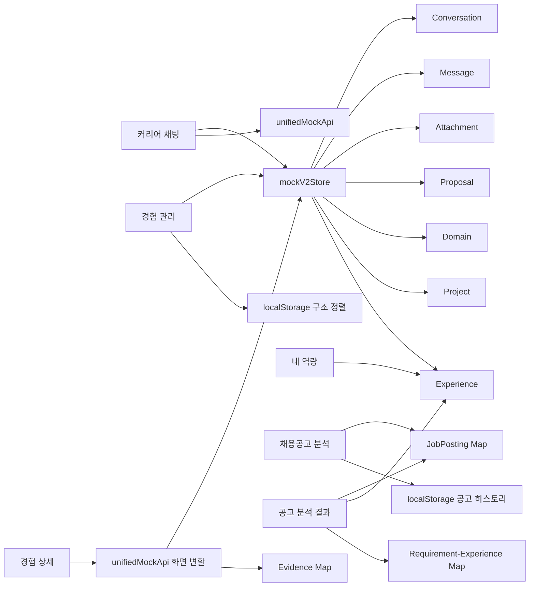
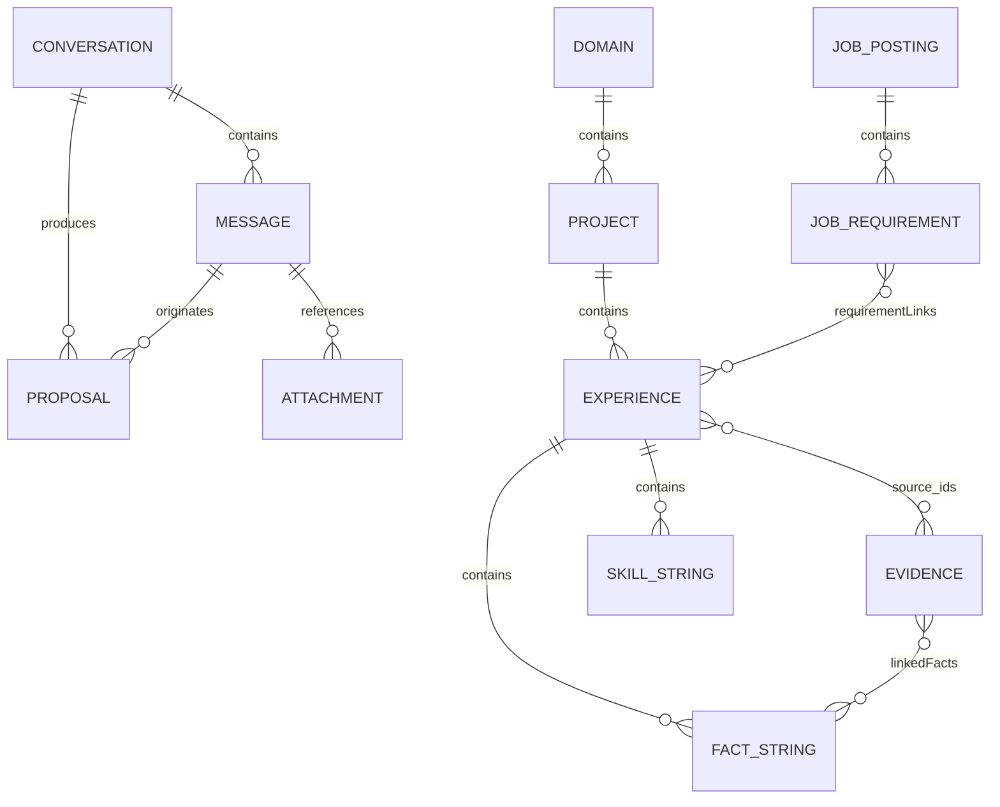
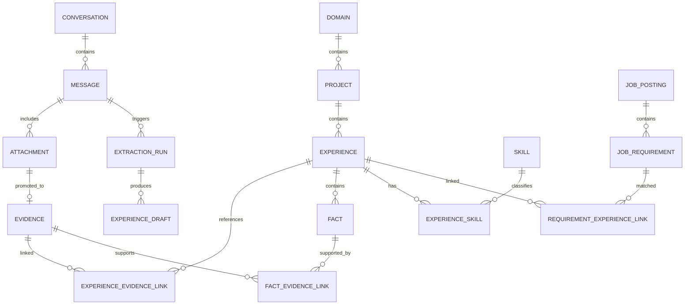

# Career Memory 데이터 구조·스키마 감사

- 재작성일: 2026-07-24 (채팅 다중 경험·근거 흐름 반영)
- 기준: 현재 워크스페이스의 실제 프론트엔드 코드와 목 API
- 범위: 라우트, 페이지, API, 목 저장소, 브라우저 저장소, 화면 모델, 엔티티 관계
- 목적: AI 채팅으로 수집한 정보가 경험·근거·역량·채용공고 데이터로 저장되고 모든 페이지에서 같은 데이터로 연결되는지 확인

---

## 1. 최종 결론

현재 프론트엔드는 **Experience를 중심으로 일부 화면이 같은 목 데이터를 공유하지만, 전체 서비스가 하나의 통합 스키마와 저장소를 사용하는 상태는 아니다.**

현재 구조는 크게 세 저장 영역으로 나뉜다.

1. `mockV2Store`
   - 대화, 메시지, 첨부, AI 제안
   - 경험 분류, 프로젝트·활동, 경험
2. `unifiedMockApi` 내부 Map
   - 원본 근거, 채용공고, 요구사항-경험 연결
3. `localStorage`
   - 공고 분석 히스토리
   - 경험 구조의 수동 정렬 순서

이 때문에 실행 중에는 연결되어 보이더라도 새로고침이나 직접 URL 접근 후에는 일부 데이터가 사라지거나 서로 다른 상태가 될 수 있다.

### 현재 연결 판정

| 데이터 흐름 | 현재 상태 | 판정 |
|---|---|---|
| 경험 관리 ↔ 경험 상세 | 같은 `mockV2Store.experiences` 사용 | 연결 |
| 경험 관리 ↔ 내 역량 | Experience의 `skills[]`를 집계 | 연결 |
| 경험 관리 ↔ 공고 매칭 | 같은 Experience 목록 사용 | 연결 |
| 채팅 제안 → Experience 저장 | `experiences[]` 전체를 승인하고 경험별 Domain/Project를 실제 구조 리소스로 정규화 | 연결 |
| Experience ↔ Evidence | `source_ids[]`와 `source_refs[]`를 함께 저장하고 원문·파일 메타데이터를 보존 | 연결(목데이터) |
| Experience ↔ Evidence 연결 해제 | Experience 참조·개수·상태까지 함께 갱신 | 개선 완료 |
| Evidence 원본 보존 | 연결 해제 시 Evidence Map에서 삭제하지 않음 | 개선 완료 |
| Fact ↔ Evidence | 문자열 기반 `linkedFacts[]`와 상태 Map 사용 | 임시 연결 |
| JobPosting ↔ JobRequirement | JobPosting 내부 배열 | 연결 |
| JobRequirement ↔ Experience | 별도 메모리 Map의 ID 집합 | 런타임 한정 |
| JobPosting ↔ 분석 히스토리 | 본체는 메모리, 히스토리는 `localStorage` | 불일치 |
| Conversation ↔ Message ↔ Proposal | 같은 V2 메모리 저장소 | 런타임 한정 |
| Attachment ↔ Evidence | 첨부 ID를 Evidence source ID로 승격하고 TXT 원문을 함께 보존 | 연결(목데이터) |
| 문서/자기소개서 | 라우트와 API만 남고 현재 주요 흐름에서 제외 | 미연결 |

---

## 2. 현재 전체 데이터 흐름



---

## 3. 저장소와 데이터 수명

### 3.1 `mockV2Store`

파일: `src/api/v2/mockV2Store.js`

```text
conversations[]
messages[]
attachments[]
sources[]
proposals[]
domains[]
projects[]
experiences[]
deleted:
  domains[]
  projects[]
  experiences[]
```

- ES 모듈 메모리에 존재한다.
- 페이지 이동 중에는 유지된다.
- 브라우저 새로고침 시 초기 목 데이터로 돌아간다.
- 삭제된 Domain, Project, Experience는 메모리 휴지통으로 이동한다.
- 휴지통도 새로고침하면 초기화된다.

### 3.2 `unifiedMockApi` 내부 Map

파일: `src/api/unifiedMockApi.js`

```text
jobs: Map<jobId, JobPosting>
requirementLinks: Map<jobId:requirementId, Set<experienceId>>
evidence: Map<sourceId, Evidence>
```

- 모두 메모리 데이터다.
- 새로고침 시 사라진다.
- `resetMockV2Store()`는 이 Map들을 초기화하지 않는다.
- 테스트 또는 장시간 개발 세션에서 초기화 기준이 서로 달라질 수 있다.

### 3.3 `localStorage`

| 키 | 데이터 |
|---|---|
| `career-memory.job-analysis-history.v1` | 공고 분석 히스토리 전체 객체 |
| `career-memory.experience-structure-order.v1` | Domain, Project, Experience 수동 정렬 ID |

공고 히스토리는 JobPosting 전체에 가까운 데이터를 저장하지만, `jobApi.get()`은 `jobs` 메모리 Map을 조회한다. 따라서 히스토리 카드와 공고 조회 API의 저장 원천이 다르다.

### 3.4 HTTP 전환 구조

`apiMode`에 따라 목 API와 실제 HTTP API를 선택한다.

- `experienceApi`, `jobApi`: 목 핸들러가 없으면 `unifiedMockApi` 사용
- `sourceApi`: 목 모드에서 `unifiedMockApi` 직접 사용
- `coverLetterApi`, `inputApi`: 현재 통합 목 저장소와 별개인 HTTP/MockAdapter 경로 사용
- 일부 API는 새 모델과 레거시 모델이 함께 존재한다.

---

## 4. 현재 엔티티 스키마

아래 스키마는 현재 코드가 실제로 생성하거나 읽는 필드를 기준으로 한다.

### 4.1 Conversation

대화 세션.

```text
id: string
title: string
status: active | deleted
message_count: number
pending_proposal_count: number
last_message_preview?: string
created_at: ISO datetime
updated_at: ISO datetime
version: number
```

관계:

```text
Conversation 1 ── N Message
Conversation 1 ── N Proposal
```

### 4.2 Message

사용자 또는 AI의 개별 메시지.

```text
id: string
conversation_id: string
role: user | assistant
status: string
content: string
requested_intent: auto | experience | job
resolved_intents: string[]
attachment_ids: string[]
citations: Citation[]
proposal_ids: string[]
actions: unknown[]
created_at: ISO datetime
completed_at: ISO datetime
```

### 4.3 Attachment

채팅에 업로드된 파일.

```text
id: string
filename: string
mime_type: string
size_bytes: number
kind: pdf | text
status: ready
created_at: ISO datetime
```

채팅 목 경로에서 TXT는 `raw_text`를 보존하고, PDF는 파일 메타데이터를 보존한다. 실제 운영 API에서는 파일 저장 URL·해시·파싱 상태를 별도 필드로 확장해야 한다.

### 4.4 Proposal

AI가 만든 저장 전 초안.

```text
id: string
conversation_id: string
originating_message_id: string
type: create_experiences | analyze_job
status: pending | edited | approved | rejected
title: string
summary: string
payload: ExperienceProposalPayload | JobProposalPayload
source_refs: SourceReference[]
warnings: string[]
created_at: ISO datetime
updated_at: ISO datetime
version: number
```

#### ExperienceProposalPayload

```text
domain:
  name: string
project:
  name: string
experiences[]:
  domain:
    name: string
  project:
    name: string
  title: string
  summary: string
  situation: string
  actions: string[]
  results: string[]
  role: string
  facts: string[]
  skills: string[]
  missing_information: string[]
  source_ref_ids: string[]
  source_refs: SourceReference[]
```

주의:

- 한 번의 텍스트 입력 또는 여러 첨부 파일은 `experiences[]`의 여러 후보로 분해될 수 있다.
- 각 후보는 반드시 `domain → project → detail` 계층을 가진다. 이름이 없는 경우 목 분석기가 기본 분류·프로젝트를 만든다.
- 채팅 UI는 `experiences[]` 전체를 동일한 상세 구조로 표시하고 수정한다.
- 승인 API는 별도 선택값이 없으면 배열 전체를 저장하고, 각 후보의 Domain·Project를 실제 ID 리소스로 생성·연결한다.
- 입력 텍스트는 대화 원문 Source, 파일은 파일 Source로 보존하며 여러 경험이 같은 원문 Source를 공유할 수 있다.

#### JobProposalPayload

```text
job_draft:
  posting_title: string
  company_name: string
  role_name: string
  source_url: string
  posting_content: string
```

### 4.5 Domain

경험 구조의 최상위 분류.

```text
id: string
name: string
created_at: ISO datetime
updated_at: ISO datetime
version: number
```

파생 필드:

```text
project_count
experience_count
```

### 4.6 Project

Domain 아래의 프로젝트·활동 묶음.

```text
id: string
domain_id: string
name: string
organization: string
created_at: ISO datetime
updated_at: ISO datetime
version: number
```

### 4.7 Experience

현재 서비스의 핵심 엔티티.

#### 저장 모델

```text
id: string
title: string
summary: string
domain:
  id: string
  name: string
project:
  id: string
  name: string
  organization: string
period: string | object
situation: string
actions: string[]
results: string[]
role: string
facts: string[]
fact_evidence_status?:
  [factText]: supported | needs_evidence
skills: string[]
missing_information: string[]
source_ids: string[]
evidence_count: number
evidence_status: verified | missing
created_at: ISO datetime
updated_at: ISO datetime
version: number
```

`fact_evidence_status`는 최근 근거 연결 해제 기능에서 추가됐다. 현재 키가 Fact ID가 아니라 사실 문자열이므로 문구가 수정되면 상태 연결이 끊길 수 있다.

#### 공통 화면 모델

`unifiedMockApi.toExperience()`가 변환한다.

```text
id
domainId
domainName
projectId
projectName
organization
period
title
summary
situation
actions[]
results[]
role
facts[]
factEvidenceStatus
skills[]
missingInformation[]
sourceRefs[]
evidenceCount
visibility
createdAt
updatedAt
version
```

#### 필드 변환

| 저장 모델 | 화면 모델 |
|---|---|
| `domain.id` | `domainId` |
| `domain.name` | `domainName` |
| `project.id` | `projectId` |
| `project.name` | `projectName` |
| `project.organization` | `organization` |
| `fact_evidence_status` | `factEvidenceStatus` |
| `missing_information` | `missingInformation` |
| `source_ids` | `sourceRefs` |
| `evidence_count` | `evidenceCount` |
| `created_at` | `createdAt` |
| `updated_at` | `updatedAt` |

경험 관리 V3와 공고 분석 결과 페이지는 이 변환기를 항상 공유하지 않고 자체 변환 함수를 사용한다.

### 4.8 Evidence

원본 텍스트 또는 파일 근거.

```text
id: string
rawId: string
sourceType: text | file
text: string
filename?: string
page?: number
capturedAt: ISO datetime
uploadedAt?: ISO datetime
updatedAt?: ISO datetime
linkedFacts:
  fact: string
  quote: string
```

현재 동작:

1. Experience의 `source_ids[]`를 읽는다.
2. Evidence Map에 해당 ID가 없으면 `ensureEvidence()`가 목 Evidence를 생성한다.
3. 첫 번째 source는 text, 나머지는 file로 임의 판정한다.
4. 파일 업로드 날짜는 Experience의 생성 시각을 기반으로 만든다.
5. 모든 Experience facts를 각 Evidence의 `linkedFacts[]`로 복제한다.

따라서 현재 Evidence는 실제 업로드 원본이라기보다 Experience에서 파생한 목 객체에 가깝다.

### 4.9 Experience-Evidence 연결

현재 별도 엔티티는 없고 다음 배열로 표현한다.

```text
Experience.source_ids: string[]
```

#### 현재 연결 해제 동작

`sourceApi.unlink(experienceId, sourceId)`:

1. 해당 Experience의 `source_ids`에서 sourceId 제거
2. `evidence_count` 재계산
3. `evidence_status` 재계산
4. 남은 Evidence가 각 Fact를 지지하는지 계산
5. `fact_evidence_status`를 `supported` 또는 `needs_evidence`로 저장
6. Evidence Map의 원본 객체는 삭제하지 않음
7. UI에 영향받은 Fact 개수를 안내

응답:

```text
experience: ExperienceScreenModel
sources: Evidence[]
unlinkedSourceId: string
sourceDeleted: false
unsupportedFacts: string[]
```

개선된 점:

- 연결 해제가 원본 삭제와 분리됐다.
- Experience의 근거 개수와 상태가 동기화된다.
- 근거가 사라진 Fact를 삭제하지 않는다.

남은 한계:

- ExperienceEvidenceLink가 독립 엔티티가 아니다.
- Evidence Map은 새로고침 시 사라진다.
- 연결 해제된 Evidence를 조회할 전역 Source Library 저장 API가 없다.
- `sourceApi.remove()` 전역 삭제 API는 남아 있지만 현재 원본 관리 UI에서는 사용하지 않는다.

### 4.10 Fact

현재 별도 객체가 아니라 Experience의 문자열 배열이다.

```text
facts: string[]
```

Evidence 내부에서도 문자열로 다시 참조한다.

```text
linkedFacts:
  fact: string
  quote: string
```

문제:

- Fact ID가 없다.
- 사실 문구 수정 시 Evidence 연결과 상태 Map 키가 함께 바뀌지 않는다.
- 동일한 문장의 중복 Fact를 구분할 수 없다.

### 4.11 Skill

백엔드의 기본 저장 필드는 아직 `Experience.skills[]`이지만, 프론트는 `skillModel.js`의 정규화 projection을 통해 `Skill`과 `ExperienceSkill` 형태로 소비한다. AI 엔진이 `skill_links`를 내려주면 해당 연결을 우선 사용하고, 기존 `skills[]`만 있으면 호환 fallback을 사용한다.

```text
Experience.skills: string[]
```

내 역량 화면은 `buildSkillProfile(experiences)`가 만든 Skill·ExperienceSkill projection을 집계한다. 기존 데이터의 그룹은 fallback 규칙으로 생성되며, AI가 제공한 그룹 ID·이름·신뢰도·근거 ID가 있으면 이를 우선 사용한다.

비율 의미:

```text
해당 그룹 태그 출현 횟수 / 전체 역량 태그 출현 횟수
```

숙련도, 달성률, AI 신뢰도는 아니다.

### 4.12 JobPosting

```text
jobId: string
companyName: string
roleName: string
postingTitle: string
sourceUrl: string
postingContent: string
requirements: JobRequirement[]
warnings: string[]
analyzedAt: ISO datetime
```

### 4.13 JobRequirement

```text
id: string
type: responsibility | qualification | collaboration
text: string
importance: required | preferred
keywords: string[]
```

현재 JobRequirement는 JobPosting 내부 배열이며 독립 저장소가 없다.

### 4.14 RequirementExperienceLink

현재 저장 형태:

```text
Map key: `${jobId}:${requirementId}`
Map value: Set<experienceId>
```

API 응답 형태:

```text
jobId
requirementId
experienceId
linked: boolean
source: user
updatedAt
```

문제:

- AI 추천과 사용자 직접 선택이 영구 데이터로 구분되지 않는다.
- 유사도 점수와 추천 이유가 링크에 저장되지 않는다.
- 새로고침하면 사라진다.
- 삭제·변경 이력이 없다.

### 4.15 JobMatchResult

```text
jobId
matches[]:
  requirementId
  requirementText
  status: direct | noEvidence
  reason
  linkedExperienceIds[]
  experiences[]:
    ExperienceScreenModel
    experienceId
    score
    evidence:
      sourceId
  missingInformation[]
failures[]
```

현재 추천 점수는 RAG가 아니라 요구사항 키워드가 Experience의 제목·요약·역량·행동·결과에 포함되는지 세는 목 로직이다.

### 4.16 Document

`DocumentPage`가 기대하는 개략 구조:

```text
id
jobId
question
content
version
evidence[]
```

현재 `coverLetterApi`는 HTTP API를 호출하며 통합 목 저장소에 Document 엔티티가 없다. 공고 결과 흐름에서도 자기소개서 기능은 제외된 상태다.

---

## 5. 페이지별 데이터 사용 현황

### 5.1 `/chat`, `/chat/:conversationId`

화면: 커리어 채팅 및 대화 기록

읽기:

- Conversation
- Message
- Attachment
- Proposal

쓰기:

- 대화 생성·이름 변경·삭제
- 메시지 생성
- 첨부파일 메타데이터 생성
- Experience 또는 Job Proposal 생성·수정·승인·거절

Experience 승인 흐름:

```text
대화/첨부
→ Proposal.payload.experiences[]
→ UI는 첫 항목만 표시
→ 승인
→ mockV2Store.experiences에 삽입
```

잔여 문제:

- `experiences[0]`만 검토 가능
- Domain/Project가 이름만 포함
- 승인 함수가 `createExperience()`의 정규화 로직을 사용하지 않음
- 승인 Experience의 `domain.id`, `project.id`가 없을 수 있음
- `listStructure()`는 Project ID로 묶기 때문에 경험 관리 구조에서 누락될 수 있음
- Attachment ID가 source ID로 들어가지만 Evidence 승격 정보가 없음
- Conversation, Message, Attachment, Proposal은 새로고침 시 사라짐

### 5.2 `/memory`

화면: 경험 관리

읽기:

- Domain
- Project
- Experience
- `skills[]`
- `source_ids[]`, `evidence_count`
- 구조 정렬 localStorage

쓰기:

- Domain 생성·이름 변경·삭제·순서 변경
- Project 생성·이름 변경·삭제·이동·순서 변경
- Experience 생성·수정·삭제·이동·순서 변경
- 편집 모드의 임시 변경사항 저장·취소

화면 파생값:

| UI | 계산 원천 |
|---|---|
| 전체 경험 | Experience 개수 |
| 경험 근거 | `evidenceCount` 합계 |
| 내 역량 | `skills[]` 집계 |
| 검색 결과 | Domain, Project, Experience 텍스트 |

잔여 문제:

- ExperienceManager V3가 자체 `toView()` 변환을 사용한다.
- 수동 정렬은 남지만 Experience 데이터는 새로고침 후 초기화된다.
- 채팅에서 저장된 ID 없는 Domain/Project 경험은 구조 트리에서 누락될 수 있다.
- 경험 근거 요약 패널은 일부 자체 생성 데이터도 사용해 상세 Evidence와 완전히 동일하지 않다.

### 5.3 `/memory/:experienceId`

화면: 경험 상세 및 원본 근거 관리

읽기:

- Experience 화면 모델
- Evidence 목록
- Evidence의 연결된 사실
- 업로드/캡처 날짜

쓰기:

- Experience 내용 수정
- 텍스트 Evidence 수정
- 현재 Experience와 Evidence 연결 해제
- 파일 다운로드

현재 근거 연결 해제:

- 버튼명: `경험에서 연결 해제`
- 원본 Evidence는 삭제하지 않음
- Experience의 근거 참조·개수·상태 갱신
- 근거가 없어진 Fact 상태 계산
- 확인창과 완료 안내 제공

잔여 문제:

- Fact 상태는 데이터에 저장되지만 상세 화면에서 사실별 상태 배지로 항상 노출되지는 않는다.
- Evidence는 실제 독립 원본 저장소가 아니라 메모리 Map이다.
- 전역 Evidence Library에서 연결 해제한 원본을 다시 찾고 연결하는 기능이 없다.

### 5.4 내 역량 패널

읽기:

- Experience의 `role`
- Experience의 `skills[]`

쓰기:

- 없음

동작:

- 유사 역량 그룹 집계
- 그룹/태그 선택 시 경험 검색으로 연결
- 막대 및 카드 포커싱

잔여 문제:

- 백엔드에 Skill/ExperienceSkill을 독립 저장하는 API가 아직 없다.
- 기존 skills 문자열의 fallback 그룹은 정식 표준명·동의어 사전이 아니다.
- AI/RAG 결과를 `skill_links`로 저장·조회하는 백엔드 계약이 추가로 필요하다.

### 5.5 `/jobs`

화면: 채용공고 입력 및 기존 분석 히스토리

입력:

```text
postingTitle
companyName
roleName
postingContent
sourceUrl
```

쓰기:

- JobPosting 분석
- JobRequirement 생성
- `localStorage` 히스토리 저장

잔여 문제:

- JobPosting API 본체는 메모리 Map
- 히스토리 객체는 localStorage
- 히스토리 카드로 이동할 때 router state가 있으면 열리지만 직접 URL 새로고침은 실패할 수 있음

### 5.6 `/jobs/:jobId`

화면: 공고 요구사항별 경험 매칭

읽기:

- JobPosting
- JobRequirement[]
- 전체 Experience
- JobMatchResult
- RequirementExperienceLink

쓰기:

- 요구사항별 Experience 연결·해제

동작:

1. 페이지 진입 시 자동 매칭
2. 요구사항 카드 한 개를 포커싱
3. AI 추천 경험 또는 전체 경험 보기
4. Experience 선택·해제
5. 요구사항 카드에서 연결 Experience 칩 표시
6. Experience 상세 보기

잔여 문제:

- RequirementExperienceLink가 메모리 Set
- AI 추천과 사용자 직접 연결의 영구 구분 없음
- 추천 score와 reason이 링크 데이터에 저장되지 않음
- JobPosting 새로고침 문제

### 5.7 `/documents/:documentId`

화면: 자기소개서 문서 편집

현재 상태:

- 라우트 존재
- `coverLetterApi.get`, `revise`, `update` 사용
- 통합 목 저장소에 Document 없음
- 현재 공고 분석 결과에서 진입하는 주요 버튼 없음

판정: 레거시 또는 미래 기능.

### 5.8 비라우팅 레거시 `MemoryPage`

현재 라우터에는 연결되지 않는다.

사용 API:

- `inputApi.parseText`
- `inputApi.parseFiles`
- `experienceApi.commit`
- `experienceApi.chat`

이 흐름은 현재 V2 채팅·ExperienceManager 흐름과 별도 계약을 사용한다. 제거하거나 `legacy/`로 이동해 신규 개발자가 현재 API로 오인하지 않도록 해야 한다.

---

## 6. 현재 관계 모델



이 다이어그램에서 `FACT_STRING`, `SKILL_STRING`, Experience-Evidence 관계와 Requirement-Experience 관계는 정식 엔티티 테이블이 아니다.

---

## 7. 데이터 무결성 문제

### P0: AI 연동 전에 반드시 해결

#### 1. 통합 영속 저장소 부재

- 주요 데이터가 두 메모리 저장소와 localStorage에 분산
- 새로고침 후 서로 다른 데이터만 남음
- 직접 URL 접근 결과가 페이지 이동 결과와 다를 수 있음

#### 2. 채팅 승인 Experience의 구조 ID 누락

- Proposal에는 Domain/Project 이름만 존재
- 승인 로직이 정규화된 `createExperience()`를 사용하지 않음
- 경험은 저장됐지만 경험 관리 구조에서 보이지 않을 수 있음

#### 3. Attachment → Evidence 승격 규칙 부재

- 파일 업로드 메타데이터와 원본 근거가 별도 객체
- Attachment ID를 source ID로 재사용
- 파일 저장 위치, 본문, 해시, 파싱 결과가 없음

### P1: 데이터 신뢰성을 위해 필요

#### 4. Fact가 문자열

- 안정적인 ID 없음
- 수정·중복·병합·근거 상태 연결이 불안정

#### 5. Evidence가 지연 생성 목 객체

- 실제 원본이 아니라 Experience에서 생성
- 파일 업로드 날짜도 실제 업로드 이벤트가 아니라 Experience 생성 시각 기반

#### 6. RequirementExperienceLink가 정식 엔티티가 아님

- 추천 주체, 점수, 이유, 상태, 이력 저장 불가

#### 7. Experience 변환 로직 중복

- `unifiedMockApi.toExperience`
- ExperienceManager V3의 `toView`
- JobDetailPage의 `normalizeExperience`
- ChatPage의 `toUiProposal`

동일 필드가 페이지마다 다르게 누락되거나 기본값이 달라질 수 있다.

#### 8. Proposal 배열과 UI의 불일치

- 데이터는 N개 경험
- UI는 첫 경험만 검토
- 기본 승인은 전체 경험

### P2: 구조 정리

9. Skill 정식 엔티티 부재  
10. Document/자기소개서 레거시 라우트  
11. 비라우팅 MemoryPage와 레거시 API  
12. `sourceApi.remove()` 전역 삭제 경로의 사용 정책 미정  
13. `resetMockV2Store()`가 unified Map을 함께 초기화하지 않음  
14. 일부 소스 문자열의 인코딩 상태 점검 필요  

---

## 8. 권장 목표 스키마



### 8.1 Experience

```text
id
domain_id
project_id
title
summary
situation
role
period_start
period_end
status: draft | confirmed | archived
created_at
updated_at
version
```

행동과 결과를 배열로 둘 수 있지만, 순서·출처·개별 편집이 필요하면 하위 엔티티로 분리한다.

### 8.2 Evidence

```text
id
type: chat_range | text | file
conversation_id?
attachment_id?
filename?
mime_type?
storage_url?
raw_text?
content_hash
captured_at
uploaded_at?
created_at
updated_at
version
```

### 8.3 ExperienceEvidenceLink

```text
id
experience_id
evidence_id
status: active | unlinked
linked_by: ai | user
linked_at
unlinked_at?
version
```

원본 Evidence 삭제와 경험 연결 해제를 분리한다.

### 8.4 Fact

```text
id
experience_id
text
status: supported | needs_evidence | disputed
created_at
updated_at
version
```

### 8.5 FactEvidenceLink

```text
id
fact_id
evidence_id
quote
page?
start_offset?
end_offset?
confidence?
created_at
```

### 8.6 Skill

```text
id
canonical_name
group_id?
aliases[]
created_at
updated_at
```

### 8.7 ExperienceSkill

```text
experience_id
skill_id
source: ai | user
confidence?
evidence_ids[]
```

### 8.8 JobPosting

```text
id
company_name
role_name
posting_title
source_url
posting_content
analyzed_at
created_at
updated_at
version
```

### 8.9 JobRequirement

```text
id
job_posting_id
type
text
importance
keywords[]
order
created_at
updated_at
```

### 8.10 RequirementExperienceLink

```text
id
job_requirement_id
experience_id
source: ai | user
status: suggested | selected | rejected
similarity_score?
reason?
evidence_ids[]
created_at
updated_at
version
```

---

## 9. AI 채팅 → 저장 권장 흐름

한 메시지를 한 Experience로 바로 저장하면 안 된다.

- 한 파일에 여러 Experience가 있을 수 있다.
- 여러 메시지가 하나의 Experience를 완성할 수 있다.
- 일반 대화 중에도 Experience 후보가 발견될 수 있다.
- Experience 정리 모드에서도 일반 질문이 포함될 수 있다.

권장 흐름:

```text
Conversation에 메시지와 파일 누적
→ Attachment 영속 저장
→ ExtractionRun 실행
→ 0..N ExperienceDraft 생성
→ Draft마다 source references와 confidence 기록
→ 사용자 검토
   - 수정
   - 분리
   - 병합
   - 제외
   - 일부 승인
→ 승인 트랜잭션
   1. Domain 조회/생성
   2. Project 조회/생성
   3. Attachment를 Evidence로 승격
   4. Experience 생성
   5. ExperienceEvidenceLink 생성
   6. Fact 생성
   7. FactEvidenceLink 생성
   8. Skill 정규화 및 ExperienceSkill 생성
→ 모든 페이지가 같은 ID 조회
```

AI 엔진은 화면 HTML이 아니라 JSON Schema로 검증 가능한 구조화 결과를 반환해야 한다.

---

## 10. 단일 데이터 원칙

1. 원본 엔티티는 한 저장소에 한 번만 저장한다.
2. 모든 관계는 표시 이름이 아니라 ID로 연결한다.
3. ViewModel은 저장하지 않고 원본에서 계산한다.
4. snake_case ↔ camelCase 변환은 API 경계 한 곳에서만 수행한다.
5. AI 추천값과 사용자 확정값을 구분한다.
6. 원본 삭제와 연결 해제를 분리한다.
7. 연결 해제 시 파생 개수와 상태를 같은 트랜잭션에서 갱신한다.
8. 집계값은 관계에서 계산하거나 트랜잭션으로 동기화한다.
9. 새로고침과 직접 URL 접근 결과가 같아야 한다.
10. 목 API도 실제 백엔드와 동일한 Repository 인터페이스를 사용한다.

---

## 11. 권장 수정 순서

### 1단계: 단일 프론트 Repository

- `CareerMemoryRepository` 인터페이스 정의
- Conversation, Experience, Evidence, JobPosting, Link를 같은 저장 계층으로 통합
- 목 환경은 IndexedDB 또는 단일 localStorage 스냅샷 사용
- `reset()`이 모든 저장 영역을 함께 초기화하도록 구성

### 2단계: 채팅 승인 정규화

- 승인 시 `createExperience()` 사용
- Domain/Project 이름을 조회 또는 생성하고 ID 저장
- `experiences[]` 전체 검토 UI
- 항목별 승인·제외 지원

### 3단계: Evidence 정식 저장

- Attachment → Evidence 승격
- ExperienceEvidenceLink 도입
- 연결 해제된 원본을 Source Library에서 재연결 가능하게 제공
- 전역 삭제는 영향도 확인과 휴지통 정책 적용

### 4단계: Fact와 Skill 정규화

- Fact ID 도입
- FactEvidenceLink 도입
- Skill 표준명과 alias 도입

### 5단계: 공고 데이터 통합

- JobPosting과 히스토리 저장 원천 통합
- RequirementExperienceLink 정식 엔티티화
- AI 추천과 사용자 선택 상태 저장

### 6단계: 레거시 정리

- Document 기능을 미래 기능으로 격리하거나 현행 계약에 편입
- 비라우팅 MemoryPage 제거 또는 `legacy/` 이동
- 중복 ViewModel 변환 제거

---

## 12. 완료 판정 테스트

- 채팅에서 여러 Experience 초안을 만들고 일부만 승인할 수 있다.
- 승인한 Experience가 올바른 Domain/Project에 즉시 표시된다.
- 같은 Experience가 경험 관리, 상세, 역량, 공고 매칭에서 같은 ID와 내용으로 보인다.
- 파일 Attachment가 실제 Evidence로 승격된다.
- Evidence 연결 해제 후 원본은 Source Library에 남는다.
- 연결 해제 후 Experience 근거 개수와 Fact 상태가 모든 화면에서 갱신된다.
- Evidence 전역 삭제 전 연결 영향도를 확인한다.
- 새로고침 후 Conversation, Experience, Evidence, JobPosting, Link가 유지된다.
- 공고 상세 URL에 직접 접근해도 분석 결과가 열린다.
- AI 추천 링크와 사용자 직접 링크가 구분된다.
- 한 파일에서 여러 Experience를 만들 수 있다.
- 여러 메시지에서 하나의 Experience를 만들 수 있다.

---

## 13. 코드 근거

| 영역 | 파일 |
|---|---|
| 라우트 | `src/router.jsx` |
| V2 목 저장소 | `src/api/v2/mockV2Store.js` |
| 대화·제안·경험·구조 API | `src/api/v2ChatApi.js` |
| 통합 화면 모델·Evidence·Job Map | `src/api/unifiedMockApi.js` |
| Experience API | `src/api/experienceApi.js` |
| Evidence API | `src/api/sourceApi.js` |
| Job API | `src/api/jobApi.js` |
| 채팅 페이지 | `src/pages/ChatPage.jsx` |
| 채팅 Proposal 카드 | `src/features/chat/InlineProposalCard.jsx` |
| 경험 관리 | `src/features/memory-v2/ExperienceManagerV3.jsx` |
| 경험 상세 | `src/pages/MemoryDetailPage.jsx` |
| 원본 근거 UI | `src/components/memory/SourceManagerModal.jsx` |
| 채용공고 입력·히스토리 | `src/pages/JobsPage.jsx` |
| 공고 분석 결과 | `src/pages/JobDetailPage.jsx` |
| 공고 히스토리 저장 | `src/features/jobs/jobHistory.js` |
| 문서 페이지 | `src/pages/DocumentPage.jsx` |
| 초기 Experience 목 데이터 | `src/mocks/canonicalExperienceSeeds.js` |
| 데이터 연결 테스트 | `src/api/unifiedMockApi.test.js` |
