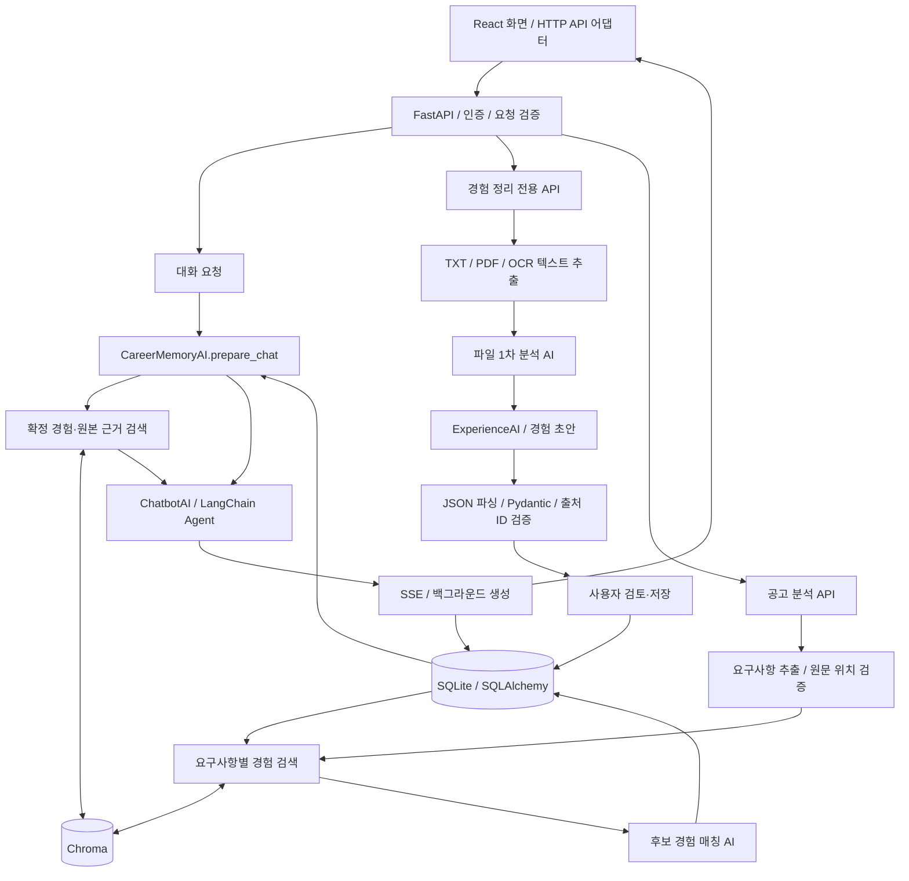
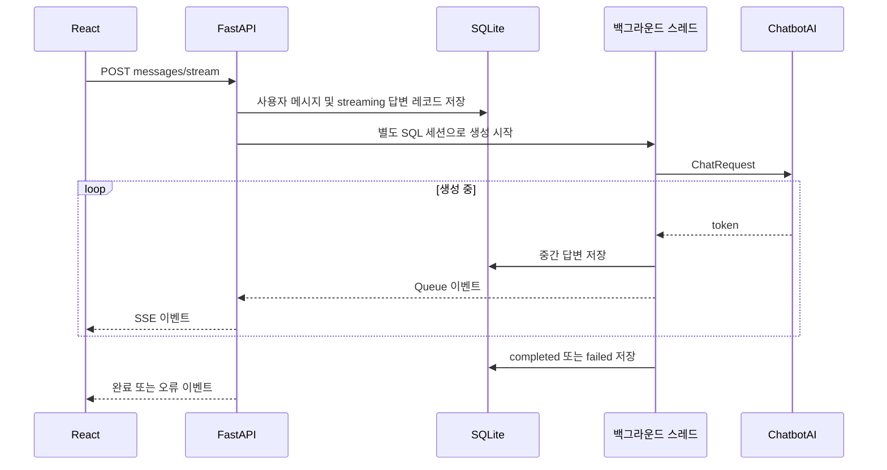
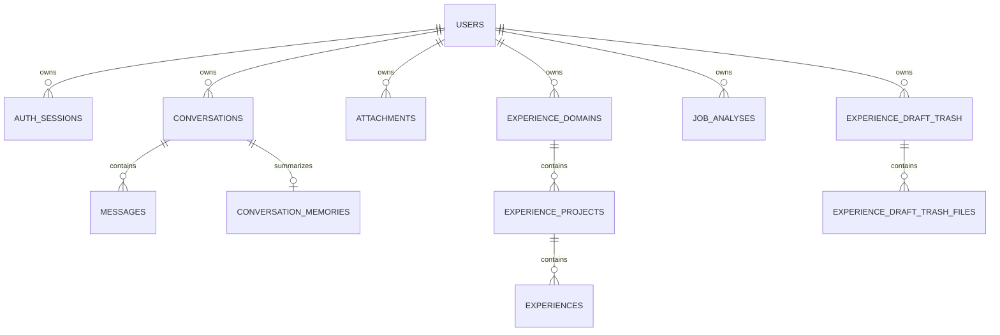

# CareerMemory — AI LLM 구현·설계·연동 명세

> 작성 기준: 2026-10-03 프로젝트 소스 코드 정적 검토.
> 대상: AI 서비스 기획자, LLM 애플리케이션 엔지니어, 백엔드 엔지니어.
> 범위: 현재 구현된 AI 모듈, 프롬프트, 함수 호출, 스키마, RAG, SQL 저장, API 및 프론트 연동.
> 모델명·수치는 코드 기본값이다. 실제 실행 설정은 환경변수에 따라 달라질 수 있으며, 이 문서 작성 과정에서 외부 AI API를 호출하거나 운영 데이터를 조회하지 않았다.

## 목차

1. [서비스의 AI 설계 목표](#1-서비스의-ai-설계-목표)
2. [전체 구성과 데이터 흐름](#2-전체-구성과-데이터-흐름)
3. [AI 모듈 수와 모델 생성](#3-ai-모듈-수와-모델-생성)
4. [LangChain·LangGraph 사용 범위](#4-langchainlanggraph-사용-범위)
5. [Function Calling과 스키마 계약](#5-function-calling과-스키마-계약)
6. [프롬프팅과 페르소나](#6-프롬프팅과-페르소나)
7. [챗봇 대화·메모리·스트리밍](#7-챗봇-대화메모리스트리밍)
8. [파일 입력과 경험 구조화](#8-파일-입력과-경험-구조화)
9. [벡터 DB와 RAG](#9-벡터-db와-rag)
10. [채용공고 분석과 경험 매칭](#10-채용공고-분석과-경험-매칭)
11. [SQL DB와 저장 구조](#11-sql-db와-저장-구조)
12. [API·프론트엔드 연동](#12-api프론트엔드-연동)
13. [호출 비용·오류·버전 관리](#13-호출-비용오류버전-관리)
14. [구현 범위와 개선 과제](#14-구현-범위와-개선-과제)
15. [포트폴리오 설명과 코드 탐색](#15-포트폴리오-설명과-코드-탐색)

## 1. 서비스의 AI 설계 목표

CareerMemory는 사용자의 대화와 자료를 근거가 있는 경력 데이터로 구조화하고, 이를 다시 검색해 커리어 대화 및 채용공고 분석에 활용한다.

핵심 데이터 수명주기는 다음과 같다.

**입력 → 원문 추출 → AI 구조화 → 사용자 검토·저장 → 확정 경험 관리 → 검색 인덱스 동기화 → RAG 검색 → 답변 또는 공고 매칭**

설계의 주요 결정은 다음과 같다.

- 대화, 파일 분석, 경험 추출, 공고 분석, 경험 매칭, 대화 요약에 별도 프롬프트와 입출력 계약을 둔다.
- 원본 자료, AI가 만든 초안, 사용자가 저장한 확정 경험을 구분한다.
- SQL DB를 원본·업무 상태 저장소로 사용하고, Chroma를 검색용 파생 인덱스로 사용한다.
- 경험 ID·출처 ID를 연결해 AI 결과에서 근거를 추적한다.
- 일반 채팅과 경험 저장을 분리하고, 경험 확정은 사용자의 실행·승인 API로 처리한다.
- 제공자 선택과 모델 생성을 공통 Factory로 모아 OpenAI·Gemini 연결을 교체할 수 있게 한다.

### 현재 코드 기준으로 꼭 구분할 사항

| 항목 | 현재 구현 |
|---|---|
| 일반 채팅의 auto 모드 | 대화로 처리한다. 일반 채팅에서 의도 분류 LLM을 매번 호출하지 않는다. |
| 경험 추출 실행 | 경험 정리 버튼 또는 전용 API가 실행한다. |
| LangGraph | LangChain `create_agent`의 실행 기반을 사용한다. 직접 설계한 서비스 전체 `StateGraph`는 없다. |
| LangGraph Checkpointer | `memory`를 명시적으로 주입했을 때만 연결한다. 기본 챗봇 생성에는 연결하지 않는다. |
| 경험·원본 근거 벡터화 | 검색 준비 시 SQL의 현재 상태와 Chroma를 동기화한다. 저장 API에서 즉시 벡터화를 호출하는 구조는 아니다. |
| 원본 근거 저장 | `Experience.source_ids/source_refs` JSON과 `Attachment`에 저장한다. 별도 ExperienceSource SQL 테이블은 없다. |
| 추출 실행 정보 | `ExtractionRun`은 Pydantic 결과 모델이다. 전용 SQL 실행 로그 테이블은 없다. |
| 공고 API | 실제 경로는 `/api/jobs`이다. |
| 매칭 점수 | LLM이 반환하는 0~1 평가값이다. 벡터 DB 거리나 검증된 합격 확률과 구분한다. |

## 2. 전체 구성과 데이터 흐름



도식의 파일 경로는 파일을 입력한 경우에 적용된다. 텍스트만으로 경험을 정리할 때는 파일 파싱·파일 분석 단계를 건너뛴다. 벡터 검색 전에는 SQL에서 읽은 현재 경험 스냅샷으로 인덱스를 동기화한다.

계층별 책임:

| 계층 | 책임 | 대표 코드 |
|---|---|---|
| 화면·API 어댑터 | 입력, 파일 업로드, SSE 수신, 초안 검토, 저장 요청 | `src/api/` |
| API | 인증·소유권, 요청 검증, 중복 요청 처리, DB 트랜잭션 | `AI_Engine/api/` |
| 문맥 조립 | 대화 이력·요약·첨부·검색 결과를 ChatRequest로 구성 | `AI_langchain.py` |
| AI 업무 모듈 | 역할별 프롬프트, 모델 호출, 응답 해석 | `chatbot_ai.py`, `experience_ai.py`, `job_analysis_ai.py` |
| Provider | 모델·임베딩 생성, Gemini 응답 형태 변환 | `llm_provider.py` |
| 검색 | Document 생성, 임베딩, Chroma 동기화·검색 | `chat_retrieval.py`, `job_analysis_ai.py` |
| 데이터 계약 | Pydantic 요청·응답·관계 검증 | `schemas/` |
| 영속화 | 사용자, 대화, 원본 파일, 확정 경험, 분석 결과 | `database/` |

## 3. AI 모듈 수와 모델 생성

### 3.1 “AI가 몇 개 있는가?”

업무를 담당하는 주요 클래스는 **6개**이며, 공고 분석 클래스 안에서 두 가지 LLM 단계를 실행하므로 **생성형 AI 역할은 7개**로 설명할 수 있다. 여기에 검색용 임베딩 모델이 별도로 연결된다.

이는 독립적으로 학습한 모델 7개 또는 상시 실행 중인 서버 7개라는 뜻이 아니다. 같은 제공자·모델에 서로 다른 프롬프트와 입력을 전달하는 애플리케이션 역할 구분이다.

| 클래스·역할 | 주요 입력 | 주요 출력 | 호출 시점 |
|---|---|---|---|
| `ChatbotAI` — 대화 | 현재 질문, 이력, 요약, 첨부, 검색 결과 | 답변, citations, 스트림 이벤트 | 대화 요청 |
| `ConversationMemoryManager` — 요약 | 기존 요약, 오래된 메시지 | 요약문, 요약한 sequence 범위 | 요약 임계값 초과 시 |
| `AutoIntentClassifier` — 분류 | 요청 유형, 텍스트, 첨부 미리보기 | route, confidence, reason | 분류기를 별도 AUTO 입력으로 호출할 때 조건부 실행 |
| `ExperienceFileAnalysisAI` — 파일 분석 | 파일 텍스트 Chunk, source ID | 요약, 인용, 사실, 경험 관련 단서 | 파일을 포함한 경험 추출 |
| `ExperienceAI` — 경험 구조화 | 직접 입력·대화 근거·파일 분석 | ExperienceExtractionResult와 경험 초안 | 경험 정리 API |
| `JobAnalysisAI` — 요구사항 추출 | 공고 원문 | JobRequirement 목록 | 공고 분석 |
| `JobAnalysisAI` — 경험 매칭 | 요구사항과 해당 요구사항의 검색 후보 | RequirementExperienceLink 목록 | 후보가 있을 때 |
| 임베딩 — 생성형 역할 외 | 경험 텍스트, 근거 Chunk, 검색 쿼리 | 수치 벡터 | 색인 추가·변경 및 검색 |

### 3.2 Provider Factory

근거: [llm_provider.py](../AI_Engine/llm_provider.py)

| Factory | OpenAI 구현 | Gemini 구현 | 사용처 |
|---|---|---|---|
| `create_chat_model()` | LangChain `ChatOpenAI` | `ChatGoogleGenerativeAI` | 챗봇, 대화 요약 |
| `create_structured_client()` | OpenAI SDK `OpenAI` | 프로젝트의 `GeminiStructuredClient` | 분류, 파일 분석, 경험·공고 구조화 |
| `create_embeddings()` | `OpenAIEmbeddings` | `GoogleGenerativeAIEmbeddings` | Chroma 색인·검색 |

코드 기본 설정:

| 환경변수 | 코드 기본값·의미 |
|---|---|
| `AI_PROVIDER` | `openai` |
| `OPENAI_MODEL` | `gpt-4o-mini` |
| `OPENAI_EMBEDDING_MODEL` | `text-embedding-3-small` |
| `GEMINI_MODEL` | `gemini-3.5-flash` |
| `GEMINI_EMBEDDING_MODEL` | `gemini-embedding-2` |
| `AI_CHAT_TEMPERATURE` | `0.3` |
| `AI_CHAT_MAX_TOKENS` | `8000` |
| `AI_STRUCTURED_OUTPUT_MAX_TOKENS` | Gemini 구조화 어댑터에서 `65536` |
| API Key | 선택한 제공자의 `OPENAI_API_KEY` 또는 `GEMINI_API_KEY` |

이 값은 소스에 선언된 기본값이며 제공사의 최신 모델 목록이나 계정별 사용 가능 여부를 검증한 표가 아니다. OpenAI 구조화 호출과 Gemini 어댑터는 세부 옵션 적용 범위가 같지 않다.

챗봇과 경험 추출 API의 기본 인스턴스는 `lru_cache(maxsize=1)`로 프로세스 내에서 재사용한다. JobAnalysisAI는 해당 요청의 Retriever를 주입해 생성한다. 따라서 인스턴스 수와 외부 모델 호출 횟수는 별개다.

## 4. LangChain·LangGraph 사용 범위

### 4.1 LangChain

현재 프로젝트에서 LangChain이 제공하는 연결 기능:

- OpenAI·Gemini 채팅 모델 인터페이스
- SystemMessage·HumanMessage 구성
- Gemini `with_structured_output(..., method="json_schema")`
- `Document`와 검색 메타데이터 표현
- 제공자별 Embeddings
- Chroma 연동과 `as_retriever().invoke(query)`
- 챗봇 `create_agent()` 및 메시지 스트리밍

OpenAI 경험·공고 구조화는 OpenAI SDK의 `responses.create()`를 직접 사용한다. 모든 호출이 동일한 LangChain Chain으로 구성되어 있는 것은 아니다.

### 4.2 LangGraph

LangGraph는 작업 단계와 상태, 단계 간 이동, 실행 중간 상태 보존을 다루는 그래프 실행 프레임워크다. 이 프로젝트에서는 LangChain의 `create_agent()` 기반 챗봇 실행과 선택적 Checkpointer 연결에 해당한다.

[chatbot_ai.py](../AI_Engine/chatbot_ai.py)의 핵심 구조:

```python
agent_options = {
    "model": chatbot_model,
    "tools": [],
    "system_prompt": CHATBOT_SYSTEM_PROMPT,
}
if memory is not None:
    agent_options["checkpointer"] = memory

return create_agent(**agent_options)
```

- 기본 생성은 `memory`를 전달하지 않는다.
- `InMemorySaver`는 외부에서 명시적으로 주입했을 때만 사용한다.
- `conversation_id`를 `thread_id`로 전달하지만, 이 설정만으로 대화가 영구 저장되지는 않는다.
- 실제 대화 원문·요약은 SQLite에서 조회하고 요청마다 Agent에 전달한다.
- `tools=[]`이므로 챗봇이 Tool을 골라 SQL 저장·검색·경험 추출을 자율적으로 수행하지 않는다.
- 전체 서비스의 분기·검색·저장은 Python 서비스와 API 계층이 실행한다.

포트폴리오에서의 정확한 표현은 **“LangChain Agent를 통한 LangGraph 실행 기반 활용, DB 기반 대화 이력 주입, 선택적 Checkpointer 연동”**이다. 직접 구현한 전체 서비스 StateGraph나 Multi-Agent 협업 시스템으로 설명하면 현재 범위를 넘어선다.

## 5. Function Calling과 스키마 계약

### 5.1 함수의 세 가지 의미

| 종류 | 예시 | 실제 역할 |
|---|---|---|
| Python 함수 | `prepare_chat`, `organize`, `sync_experience_vector_store` | 서버에서 실제 로직 실행 |
| 모델에 제시하는 Function Schema | `create_experience_drafts` | 모델이 반환할 JSON arguments 형식 지정 |
| Agent Tool | 현재 챗봇은 `tools=[]` | 챗봇에는 자율 호출할 도구가 연결되어 있지 않음 |

현재 Function Calling은 주로 **모델의 의미 분석 결과를 정해진 데이터 구조로 받는 수단**이다. 함수명에 create가 있어도 모델이 그 이름의 SQL 생성 함수를 실행하는 것은 아니다. 서버가 응답을 파싱·검증한 뒤 별도 업무 로직으로 저장한다.

### 5.2 구조화 함수 목록

| Function 이름 | 목적 | 핵심 반환값 |
|---|---|---|
| `classify_career_memory_intent` | 요청 분류 | route, confidence, reason |
| `analyze_experience_file` | 파일 근거 분석 | 요약·인용·사실·경험 단서 |
| `create_experience_drafts` | 경험 초안 생성 | experience_drafts와 경험별 필드 |
| `create_job_requirements` | 공고 요구사항 추출 | requirements |
| `create_requirement_experience_links` | 요구사항별 후보 매칭 | experience_links |

OpenAI 경로의 호출 패턴:

```python
response = client.responses.create(
    model=model_version,
    instructions=SYSTEM_PROMPT,
    input=model_input,
    tools=[TOOL_SCHEMA],
    tool_choice={"type": "function", "name": TOOL_NAME},
)
```

서버는 응답에서 해당 이름의 function_call을 찾고 arguments JSON을 읽는다. Gemini 어댑터는 JSON Schema 구조화 결과를 받아 이 응답 형태로 감싸므로 상위 업무 모듈의 파싱 코드를 재사용한다.

### 5.3 검증 계층

```text
API 요청 스키마
  → AI 입력 조립
  → 모델용 strict JSON Schema
  → function_call 이름·arguments JSON 확인
  → Pydantic 데이터 구조 검증
  → 출처·후보 ID 및 업무 조건 검증
  → API 응답 또는 SQL 저장
```

공통 `SchemaModel`은 `extra="forbid"`, 할당·기본값 검증 등을 설정한다. JSON의 형식 검증과 사실 검증은 별도 단계다.

| 스키마 영역 | 대표 모델 | 책임 |
|---|---|---|
| 대화 | ChatRequest, ChatContext, ChatResponse, ChatStreamEvent | 문맥·답변·이벤트 계약 |
| 근거 | EvidenceSource, EvidenceCitation, FileEvidenceAnalysis | 출처 식별과 파일 분석 |
| 경험 | ExperienceDraft, ExperienceExtractionResult, ExtractionRun | 초안·근거 관계와 실행 결과 |
| 공고 | JobAnalysisRequest, JobRequirement, RequirementExperienceLink, JobAnalysisResult | 요구사항·추천 관계 |
| 검색 | ExperienceSearchDocument | 확정 경험의 검색 가능 조건과 Document 변환 |
| 라우팅 | AIRouteRequest, AIRouteDecision | 분류 입력·결정 정보 |

기간 순서, confidence 범위, 필수 문자열, 출처 참조 관계, 이벤트별 payload 등을 검사한다. Pydantic 도입만으로 원문의 사실성이 자동 보장되는 것은 아니므로, 인용·후보 검증을 추가로 수행한다.

## 6. 프롬프팅과 페르소나

### 6.1 프롬프트 설계 틀

업무별 Prompt는 주로 **역할(role) → 목표(task) → 문맥(context) → 제약(constraint) → 출력(format)** 순서로 작성한다. 챗봇에는 대화 전략과 예시도 포함한다.

| 역할 | 페르소나·목표 | 주요 제약 | 출력 |
|---|---|---|---|
| 커리어 챗봇 | 친절한 커리어 대화 파트너 | 현재 질문 우선, 질문은 한 번에 하나, 경험·성과 추측 금지 | 한국어 Markdown |
| 파일 분석기 | 원본 자료에서 근거를 찾는 분석 담당 | 현재 Chunk에서 인용, 원문 사실 보존 | 파일 분석 JSON |
| 경험 구조화기 | 경력 기록 정리 담당 | 사용자 수행 내용 보존, 미확인 수치·성과 생성 금지 | 경험 초안 JSON |
| 공고 분석기 | 채용 요구사항 추출 담당 | 공고에 있는 요구사항만, 인용문 그대로 유지 | 요구사항 JSON |
| 경험 매칭기 | 요구사항과 후보의 관련성 평가 담당 | 후보 밖 ID 금지, 근거 없는 추천 금지 | 추천 연결 JSON |
| 대화 요약기 | 장기 대화 메모리 정리 담당 | 새 사실 생성 금지, 미확정 상태 보존 | 구조화된 요약 텍스트 |
| 의도 분류기 | 요청 실행 종류 판정 담당 | 단어 포함 여부와 실행 의도를 구분 | route JSON |

### 6.2 챗봇 페르소나와 대화 UX

`CHATBOT_SYSTEM_PROMPT`는 친절한 말투 외에 행동 규칙까지 정의한다.

- 첫 대화에서 입력이 모호하면 서비스를 1~2문장으로 설명하고 구체적인 질문을 한다.
- 사용자의 요청이 분명하면 답변을 먼저 제공한다.
- 후속 대화에서 자기소개를 반복하지 않는다.
- 경험의 상황·행동·결과·역할·역량 중 부족한 한 항목을 자연스럽게 질문한다.
- 일반 대화를 억지로 커리어 상담으로 돌리지 않는다.
- 실제 저장하지 않은 데이터를 저장했다고 말하지 않는다.
- 검색·첨부 문맥의 사실을 활용한 문장에 `[출처:source_id]`를 붙이도록 지시한다.

첫 인사 예시 등 Few-shot 성격의 예시를 두고, 문구의 기계적 반복 대신 구조와 목적을 따르도록 지시한다.

### 6.3 동적 문맥 주입

정적 시스템 프롬프트와 별개로 요청마다 다음 정보를 조립한다.

1. 계정 표시 이름 — 명령이 아닌 데이터로 구분
2. 첫 대화 여부 — 온보딩 단계
3. 과거 대화 요약
4. 현재·이전 대화의 첨부 본문
5. 검색된 확정 경험
6. 검색된 원본 근거
7. 최근 user/assistant 메시지
8. 현재 사용자 입력

검색 결과 안의 지시문을 따르지 않도록 프롬프트에서 명시한다. 이는 Prompt Injection을 줄이기 위한 제약이며 완전한 방어를 입증한 것은 아니다.

### 6.4 생성 결과와 검증의 연결

프롬프트가 “원문을 그대로 인용”하도록 요구하면 서버도 이를 검증한다. 공고는 실제 원문에서 인용 문자열을 찾고 위치를 계산한다. 파일 1차 분석은 인용문이 Chunk에 포함되는지 확인한다. 최종 경험 초안은 출처 ID·필드 구조를 검증하지만, 모든 최종 문장을 원문과 의미 수준에서 대조하는 검증기는 구현되어 있지 않다.

## 7. 챗봇 대화·메모리·스트리밍

근거: [AI_langchain.py](../AI_Engine/AI_langchain.py), [chatbot_ai.py](../AI_Engine/chatbot_ai.py), [conversations.py](../AI_Engine/api/conversations.py)

### 7.1 일반 대화 처리

1. 대화·첨부파일이 현재 사용자 소유인지 확인한다.
2. 사용자 메시지를 SQL에 저장한다.
3. `CareerMemoryAI.prepare_chat()`이 문맥을 준비한다.
4. 일반 채팅의 AUTO 요청은 CHAT으로 결정한다.
5. 저장된 요약과 최근 메시지를 준비한다.
6. 현재 및 이전 사용자 메시지의 첨부파일을 최대 5개 선택한다.
7. 첨부 텍스트를 Chunk로 나누고 질문 단어의 등장 횟수로 파일별 상위 최대 8개를 선택한다.
8. 확정 경험과 연결된 원본 근거를 각각 RAG 검색한다.
9. 토큰 예산에 맞춰 ChatRequest를 구성한다.
10. Agent가 답변을 생성하고 API가 메시지를 저장·전달한다.

현재 대화에 첨부한 파일은 이 경로에서 곧바로 벡터화하지 않는다. 추출된 본문을 키워드 기준으로 골라 문맥에 넣는다. 이후 확정 경험의 source_refs로 연결되면 근거 인덱스의 대상이 될 수 있다.

### 7.2 IntentClassifier의 실제 연결 상태

분류기 자체에는 다음 기능이 있다.

- 명시적 모드: LLM 없이 바로 결정
- AUTO지만 실행 표현 없음: LLM 없이 CHAT
- AUTO 실행 의도 판정 필요: LLM 구조화 분류
- confidence 0.65 미만 또는 오류: CHAT fallback

다만 현재 `prepare_chat()`은 일반 AUTO 요청을 먼저 CHAT으로 처리한다. 따라서 이 분류기 기능이 존재한다는 사실과 기본 채팅 경로에서 실제 호출된다는 주장은 구분해야 한다. 경험 추출은 별도 버튼 API가 담당한다.

### 7.3 대화 요약

`ConversationMemoryManager.prepare()`는 API의 최근 메시지 조회 범위와 별개로 DB에서 완료된 user/assistant 메시지를 확인한다.

기본 조건은 미요약 메시지가 12개를 초과하고 추정 토큰 합이 16,000 이상일 때다. 최근 12개를 제외한 원문과 기존 요약을 LLM에 보내 새 요약을 만든다.

요약 항목:

- 사용자 목표
- 주요 경험과 사실
- 사용자 선호
- 진행 중인 작업
- 추가 확인 필요

`conversation_memories`에 요약문·through_sequence·모델/프롬프트 버전을 저장한다. 원본 messages는 삭제하지 않는다. 이후 답변에는 요약문과 아직 요약하지 않은 최근 메시지를 전달한다.

### 7.4 문맥 예산

| 항목 | 기본 추정 토큰 예산 |
|---|---:|
| 전체 입력 | 60,000 |
| 최근 대화 | 14,000 |
| 첨부 문맥 | 14,000 |
| 확정 경험 | 10,000 |
| 원본 근거 | 12,000 |
| 요약 실행 임계값 | 16,000 |

`estimate_tokens()`는 UTF-8 바이트 수와 공백 단위 수를 이용한 추정치다. 모델 제공자의 실제 tokenizer 계산값이나 청구 토큰 수가 아니다.

전체 예산 초과 시 검색 근거 → 경험 → 첨부 순으로 뒤쪽 문서를 줄인다. 현재 메시지·요약 자체가 매우 큰 경우까지 항상 모델 입력 상한을 보장하는 설계는 아니므로, 최대 입력 길이 검증은 개선 대상이다.

### 7.5 SSE와 저장



브라우저 이동·새로고침으로 SSE 연결이 끊겨도 프로세스의 백그라운드 스레드가 생성·저장을 계속하도록 구현되어 있다. 서버 프로세스 재시작 후 작업을 재개하는 영속 작업 큐는 아니다.

ChatbotAI 내부 이벤트는 started/token/completed/error이며 API가 프론트엔드 이벤트 계약으로 변환한다. citations는 답변에 등장한 출처 태그와 실제 입력 문서를 대조해 구성한다. 이 검사는 인용된 주장이 문서와 의미적으로 일치하는지까지 평가하지는 않는다.

## 8. 파일 입력과 경험 구조화

### 8.1 로컬 텍스트 추출

근거: [experience_file_text.py](../AI_Engine/experience_file_text.py), [job_file_text.py](../AI_Engine/job_file_text.py)

| 입력 | 처리 |
|---|---|
| TXT | UTF-8-SIG, UTF-8, CP949 순으로 디코딩 시도 |
| 텍스트 PDF | PyMuPDF로 텍스트 추출 |
| 텍스트가 부족한 PDF 페이지 | 페이지 이미지 기반 OCR 처리 |
| PNG/JPEG/WebP | Pillow 전처리 + pytesseract OCR |

이미지는 회색조·대비 보정 및 작은 이미지 확대를 수행하고 Tesseract의 kor+eng 언어를 사용한다. 이 단계는 외부 LLM Vision 호출이 아닌 로컬 파싱/OCR이다. MIME, 파일 크기·개수, PDF 페이지 수 등 입력 제한을 확인한다.

### 8.2 파일 분석과 경험 추출

```text
파일 원문
 → EvidenceSource
 → 긴 문서 Chunk 분할
 → Chunk별 analyze_experience_file 호출
 → 인용 검증
 → 파일별 분석 결과 병합
 → 직접 입력·대화 근거와 함께 ExperienceAI에 전달
 → create_experience_drafts 호출
 → Pydantic 및 출처 ID 검증
 → ExperienceExtractionResult
```

파일 분석용 Chunk 설정은 기본 12,000, overlap 300이다. 이는 코드의 토큰 근사 설정이며, 검색용 900/120 Chunk와 목적·크기가 다르다.

ExperienceAI는 파일 분석기에 동일한 구조화 Client와 모델명을 전달해 재사용한다. 긴 파일은 Chunk 수만큼 호출하고 Chunk 형식 검증 실패 시 한 번 재요청한다.

### 8.3 경험 입력·출력 계약

입력:

- `ExperienceExtractionRequest`: 요청 ID, input_type, text, 대화·메시지·첨부 식별자 등
- `EvidenceSource[]`: source ID, source type, 원문, 파일·메시지 참조

출력:

- `run`: 모델·프롬프트·스키마 버전, 시간, 입력 범위
- `experience_drafts`: 0개 이상의 구조화 초안
- `sources`: 사용한 원본 근거
- `file_analyses`: 파일 1차 분석
- `analyzed_source_ids`: 실제 분석 대상

초안의 주요 필드:

| 구분 | 필드 |
|---|---|
| 분류 | domain, project, organization, period |
| 경험 | title, summary, situation, actions, results, role |
| 역량 | skills, skill_groups |
| 근거 | facts, source_ref_ids, field_citations |
| 품질·상태 | missing_information, confidence, status |

모델이 반환한 평면 필드와 facts 인용은 애플리케이션에서 중첩된 ExperienceDraft 및 EvidenceCitation으로 변환한다. UI 초안의 모든 필드가 확정 Experience 테이블에 일대일 저장되는 것은 아니다. 예를 들어 확정 경험 모델에는 skill_groups·field_citations·confidence 전용 컬럼이 없다.

### 8.4 초안 검토·저장

- 직접 입력 추출 API는 결과를 반환한다. 해당 API 자체가 확정 경험을 생성하지 않는다.
- 채팅 기반 추출은 초안 제안을 assistant 메시지의 `actions` JSON에 저장한다.
- 승인 API는 도메인·프로젝트를 확인/생성하고 `Experience(status="confirmed")`를 만든다.
- 초안 상태 변경과 경험 생성은 같은 트랜잭션에서 처리한다.
- 저장된 경험 ID·승인 인덱스로 동일 초안의 재승인을 처리해 중복 생성을 줄인다.
- 제안 version이 달라지면 409 충돌을 반환한다.
- 대화의 마지막 성공 추출 sequence로 아직 정리하지 않은 사용자 메시지 범위를 추적한다.

원본 파일 업로드 경로는 구분된다. `/attachments`는 실제 bytes를 DB에 저장하지만, `direct-input-files`는 업로드 bytes를 읽어 분석 결과를 반환하는 경로이며 그 처리만으로 Attachment 레코드가 자동 생성되지는 않는다.

## 9. 벡터 DB와 RAG

### 9.1 검색 방식

현재 주 검색은 **임베딩 벡터 기반 Dense Retrieval RAG**다. 경험 문서와 검색 질문을 같은 임베딩 모델의 공간에 표현해 유사한 문서를 찾고, 검색된 텍스트를 LLM에 전달한다.

벡터화는 정보를 수치 배열로 변환하는 작업이다. 이 과정을 통해 LLM의 학습 가중치가 수정되는 것은 아니다. 검색된 문서는 매 요청의 컨텍스트로 제공된다.

### 9.2 두 가지 인덱스

| 구분 | 경험 인덱스 | 원본 근거 인덱스 |
|---|---|---|
| 원본 | 확정 Experience의 의미 필드 | Experience.source_refs 안의 원문 |
| Document 단위 | 경험 1건을 하나의 문서로 구성 | 원문을 여러 Chunk로 구성 |
| 내용 | 분류·프로젝트·제목·요약·상황·행동·결과·역할·역량·facts | 원문 텍스트 |
| 주요 메타데이터 | experience_id, status, title, domain_name, project_name, evidence_ids_json, content_hash, updated_at | source_id, source_type, filename, message_id, attachment_id, chunk_index, offset, content_hash, index_version |
| 저장 디렉터리 | `data/vector_store/jobs` | `data/vector_store/evidence` |
| Collection | `career_memory_experiences_<user hash>` | `career_memory_evidence_<user hash>` |
| 챗봇 기본 검색 수 | 5 | 6 |
| 사용 기능 | 챗봇·공고 매칭 | 챗봇의 원문 참조 |

사용자 ID의 SHA-256 앞 24자리를 Collection 이름에 사용한다. 이는 이름에서 원문 ID를 감추고 사용자별 검색 범위를 나누는 방식이며, 암호화나 인증 자체를 대신하지 않는다. 소유권 검사는 API와 SQL 조회 조건에서 수행한다.

### 9.3 색인 대상과 동기화

1. SQL에서 현재 사용자의 `confirmed`·미삭제 경험을 읽는다.
2. 경험 검색은 source_ids가 있는 경험을 대상으로 한다.
3. 검색 문서와 content_hash를 만든다.
4. Chroma의 기존 ID·content_hash를 읽는다.
5. 신규 문서는 add, 내용 변경은 update, 더 이상 없는 문서는 delete한다.
6. 검색 쿼리를 임베딩하고 Retriever를 실행한다.

같은 검색 텍스트는 다시 임베딩하지 않도록 구현되어 있다. 단, 경험 content_hash는 검색 본문을 기준으로 하므로 출처 ID 등 **메타데이터만 변경된 경우** 동기화가 누락될 가능성이 있다. 이는 개선 항목에 포함한다.

저장·수정·삭제 시 즉시 인덱스를 수정하는 이벤트 방식이 아니라, 검색 준비 시 현재 SQL 스냅샷과 대조한다. 검색 대상이 아예 없으면 조기 반환하는 경로가 있어, 마지막 경험 삭제 후 디스크 인덱스가 즉시 비워진다고 보장할 수는 없다.

### 9.4 Chunk와 원문 위치

근거 검색용 기본값:

- `AI_EVIDENCE_CHUNK_TOKENS=900`
- `AI_EVIDENCE_CHUNK_OVERLAP_TOKENS=120`

`split_text_chunks()`는 실제 tokenizer 대신 문자 수 근사와 문단·줄·문장 경계를 사용한다. offset은 줄바꿈을 정규화한 텍스트 범위를 나타내며 PDF 원본의 페이지 좌표가 아니다.

### 9.5 무엇과 무엇을 비교하는가?

| 단계 | 비교 대상 | 판단 주체 |
|---|---|---|
| 첨부 문맥 선택 | 질문 단어 ↔ 첨부 Chunk의 단어 등장 횟수 | Python |
| 일반 경험 검색 | 질문 벡터 ↔ 경험 문서 벡터 | Chroma |
| 근거 검색 | 질문 벡터 ↔ 원본 Chunk 벡터 | Chroma |
| 공고 후보 검색 | 요구사항 제목·설명·키워드 벡터 ↔ 경험 벡터 | Chroma |
| 최종 공고 매칭 | 요구사항 의미 ↔ 검색 후보 경험 내용 | LLM |
| 인용 검증 | 생성된 인용문 ↔ 제공된 원문 | Python |
| 참조 검증 | 반환된 경험·근거 ID ↔ 실제 후보의 허용 ID | Python |

### 9.6 장애 시 fallback

챗봇의 경험·근거 벡터 검색에 예외가 발생하면 질문 단어 등장 횟수 기반 lexical 검색으로 대체한다. TF-IDF, BM25, Dense와 Sparse 점수의 결합 검색은 구현되어 있지 않다.

공고 분석 API는 Retriever 준비 실패 시 경고를 남기고 요구사항 추출만 제공한다. 챗봇 fallback과 공고 분석 fallback은 동작이 다르다.

## 10. 채용공고 분석과 경험 매칭

근거: [job_analysis_ai.py](../AI_Engine/job_analysis_ai.py), [jobs.py](../AI_Engine/api/jobs.py)

### 10.1 단계별 입력·출력

| 단계 | 입력 | 출력 | 모델 호출 |
|---|---|---|---|
| 원문 준비 | 직접 공고 텍스트 또는 로컬 추출 텍스트 | source별 원문 | 없음 |
| 요구사항 추출 | 공고 원문 + 요구사항 Prompt | type, title, summary, source, source_excerpt, importance, keywords, confidence | 생성형 1회 |
| 근거 검증 | source_excerpt + 원문 | 검증된 인용과 시작·종료 위치 | 없음 |
| 후보 검색 | 요구사항 제목 + 요약 + 키워드 | 요구사항별 확정 경험 후보 | 쿼리 임베딩·벡터 검색 |
| 매칭 | 요구사항과 각자의 후보 경험 | requirement_id, experience_id, similarity_score, reason, evidence_ids | 후보가 있으면 생성형 1회 |
| 결과 저장 | JobAnalysisResult | JobAnalysisRecord | 없음 |

요구사항이 여러 개여도 최종 매칭 단계는 요구사항별 후보를 모아 한 번의 LLM 요청으로 전달한다. 후보 검색은 요구사항별로 실행한다.

### 10.2 요구사항 원문 검증

모델은 원문 인용을 반환하고, 서버는 등록된 source인지 확인한 후 `source_text.find(source_excerpt)`로 원문 포함 여부와 offset을 확인한다. ID와 순서·위치는 애플리케이션이 만든다.

### 10.3 추천 제약

- 확정 경험과 evidence ID가 있는 후보만 사용한다.
- 자격증·면허처럼 명칭이 중요한 요구사항은 명시적 조건으로 관련 없는 후보를 거른다.
- 반환한 experience_id가 해당 요구사항의 후보 집합에 있어야 한다.
- evidence_ids는 그 경험 후보의 근거 ID 부분집합이어야 한다.
- 기본 최소 점수 0.65 미만은 제외한다.
- AI 연결은 suggested 상태로 생성하고 사용자의 선택을 대신 확정하지 않는다.

`similarity_score`는 LLM의 관련성 평가 결과다. Chroma 거리 점수를 그대로 노출한 값이 아니며, 동일한 숫자가 항상 동일한 정답 가능성을 뜻하지 않는다.

### 10.4 재매칭

확정 경험이 늘거나 변경되었을 때 `rematch_requirements()`는 기존 요구사항으로 검색·매칭을 다시 한다. 요구사항 추출을 재실행하지 않아 해당 단계의 비용을 줄인다.

`source_url`은 공고 메타데이터로 다룬다. URL만 주면 웹을 자동 수집하는 크롤러가 구현되어 있다고 설명하지 않는다. 분석에는 제공된 공고 텍스트가 필요하다.

## 11. SQL DB와 저장 구조

### 11.1 저장 기술

- 기본 DB: SQLite
- ORM: SQLAlchemy
- 기본 파일: `data/career_memory.db`
- 데이터 루트: `CAREER_MEMORY_DATA_ROOT` 또는 프로젝트 루트
- 연결 재정의: `DATABASE_URL`
- 서버 초기화: `Base.metadata.create_all()` 및 기존 SQLite 호환용 일부 컬럼 보완 로직

SQLAlchemy를 사용한다는 사실만으로 다른 DB에서 마이그레이션·운영 검증까지 완료된 것은 아니다.

### 11.2 실제 SQL 테이블 12개

| 테이블 | 주요 저장 내용 |
|---|---|
| users | 사용자 정보, 비밀번호 해시 |
| auth_sessions | 세션 token hash, CSRF token, 만료·폐기 정보 |
| conversations | 대화 제목·상태·버전·메시지 수·추출 진행 범위 |
| conversation_memories | 요약문, through_sequence, 모델·Prompt 버전 |
| messages | 원문, role, sequence, 상태, 첨부 ID, citations, actions, 오류 |
| attachments | 원본 bytes(BLOB), filename, MIME, hash, extracted_text, 파싱 상태 |
| experience_domains | 사용자별 경험 분류 |
| experience_projects | 분류에 속한 프로젝트·활동 |
| experiences | 확정 경험, JSON 목록, source_ids, source_refs, version, deleted_at |
| experience_draft_trash | 삭제되거나 저장에 실패한 초안 JSON·원문 |
| experience_draft_trash_files | 휴지통 원본 파일 bytes |
| job_analyses | 공고 원문, 요구사항 JSON, 경험 연결 JSON, 경고, versions |

### 11.3 관계 개요



메시지의 attachment_ids, 경험의 source_refs, 공고의 experience_links 등 일부 연결은 JSON 참조다. ER 도식의 별도 관계 테이블로 정규화되어 있는 것은 아니다.

### 11.4 객체와 테이블 구분

`EvidenceSource`, `ExtractionRun`, `JobRequirement`, `RequirementExperienceLink`는 AI 계약을 나타내는 Pydantic 객체다.

- EvidenceSource는 경험의 source_refs 또는 추출 결과에 포함된다.
- ExtractionRun은 추출 결과에 포함된다. 모든 실행을 SQL에 독립 보관하는 테이블은 없다.
- JobRequirement와 RequirementExperienceLink는 job_analyses의 JSON 컬럼에 저장된다.
- 채팅 경험 초안은 messages.actions에 보관한다.

“객체가 존재한다”와 “동명 테이블로 영구 저장한다”를 구분하는 것이 이 서비스의 데이터 모델을 이해하는 핵심이다.

## 12. API·프론트엔드 연동

React 화면은 `src/api/`를 통해 서버를 호출한다. `config.js`에서 HTTP와 Mock 경로를 선택한다. 실제 서버 연결에는 `VITE_USE_MOCK=false` 설정이 필요하며, 테스트 모드는 Mock을 사용한다.

| 기능 | 주요 실제 API |
|---|---|
| 대화 생성·조회 | `/api/v2/conversations` |
| 대화 메시지 | `/api/v2/conversations/{id}/messages` |
| 스트리밍 | `/api/v2/conversations/{id}/messages/stream` |
| 최근 대화 경험 추출 | `/api/v2/conversations/{id}/experience-extractions` |
| 채팅 경험 승인 | `/api/v2/conversations/{id}/messages/{message_id}/experience-proposal/approve` |
| 직접 입력 추출 | `/api/v2/experience-extractions/direct-input` |
| 파일 포함 추출 | `/api/v2/experience-extractions/direct-input-files` |
| 첨부 관리 | `/api/v2/attachments` |
| 확정 경험 CRUD | `/api/v2/experiences` |
| 경험 근거 추가 | `/api/v2/experiences/{id}/sources/text`, `.../sources/files` |
| 근거로 재정리 | `/api/v2/experiences/{id}/reorganize-from-sources` |
| 공고 파일 텍스트 추출 | `/api/jobs/extract-text` |
| 공고 분석 | `/api/jobs/analyze` |
| 공고 재매칭 | `/api/jobs/{job_id}/match` |

일반 요청은 JSON, 파일 포함 요청은 multipart/form-data, 대화 생성 스트림은 SSE를 사용한다. API는 인증된 사용자 ID로 소유권을 확인하고, AI 모듈에는 필요한 텍스트·문서·식별자를 전달한다.

## 13. 호출 비용·오류·버전 관리

### 13.1 사용자 작업별 생성형 호출 수

SDK의 내부 네트워크 재시도와 임베딩 batch 호출을 제외한 애플리케이션의 논리적 호출 수다.

| 작업 | 정상 경로의 생성형 호출 |
|---|---|
| 짧은 일반 대화 | 답변 1회 |
| 요약 임계값을 넘은 대화 | 요약 1회 + 답변 1회 |
| 직접 텍스트 경험 추출 | 경험 구조화 1회 |
| 파일 포함 경험 추출 | 파일 Chunk 전체 개수만큼 분석 + 경험 구조화 1회 |
| 공고 분석, 후보 있음 | 요구사항 추출 1회 + 매칭 1회 |
| 공고 분석, 후보 없음 | 요구사항 추출 1회 |
| 재매칭, 후보 있음 | 매칭 1회 |
| 분류기를 AUTO로 별도 실행 | 단축 조건을 통과하면 분류 1회 |

경험 추출은 직접 입력 결과가 빈 배열이면 한 번 재검토한다. 구조 변환 검증이 실패하면 형식 재요청을 한 번 수행한다. 두 조건이 연달아 적용되면 경험 구조화 호출이 최초 호출을 포함해 최대 3회가 될 수 있다. 파일 분석은 Chunk별 형식 검증 실패에 한 번 재요청한다.

임베딩 비용은 신규·수정 문서 임베딩과 쿼리 임베딩에서 별도로 발생한다. 같은 검색 본문에 대한 재임베딩 생략, 요구사항 재추출을 생략하는 rematch, 대화 요약과 문맥 예산이 비용·입력 길이 관리 수단이다.

### 13.2 오류 처리

| 오류 | 현재 대응 |
|---|---|
| API 요청·파일 형식 오류 | 422 등 입력 오류 |
| 구조화 출력 검증 실패 | 제한적 재요청 또는 AI 출력 오류 |
| 의도 분류 실패 | CHAT fallback |
| 챗봇 벡터 검색 실패 | lexical fallback |
| 공고 Retriever 준비 실패 | 경고와 요구사항 분석 제공 |
| 답변 생성 실패 | failed 메시지와 오류 이벤트 저장 |
| 경험 승인 version 충돌 | 409 |
| 중복 승인·일부 중복 요청 | 저장된 결과 재사용 |

서버 로그에 내부 원인을 남기고 사용자 응답에는 처리 가능한 오류 메시지를 제공한다. 실제 대규모 운영을 위한 분산 큐·일괄 재시도·비용 경보가 구현된 것으로 설명하지 않는다.

### 13.3 버전 추적의 실제 저장 범위

| 결과·저장소 | 버전 정보 |
|---|---|
| ChatResponse | model_version, prompt_version, schema_version 등 |
| ExperienceExtractionResult.run | 모델·Prompt·Schema·시각 |
| conversation_memories | 모델·Prompt·요약 version |
| job_analyses.versions | 모델·Prompt·Schema·index |
| 경험 검색 Document | content_hash, updated_at |
| 원본 근거 Document | content_hash, evidence index_version |

messages에는 모델·Prompt·Schema 전용 컬럼이 없다. ChatResponse에 버전이 있다는 이유만으로 모든 답변 버전이 영구 SQL 로그에 남는다고 설명하면 안 된다.

또한 버전 정보만으로 완전한 재현성이 확보되는 것은 아니다. 당시 입력 문맥·모델 옵션·응답·실제 사용량의 보관 범위도 함께 설계해야 한다.

## 14. 구현 범위와 개선 과제

### 14.1 현재 근거를 가지고 설명할 수 있는 성과

- 파일·대화 입력을 경험 초안으로 바꾸는 단계별 AI 파이프라인
- 사용자 검토 후 확정 경험으로 저장하는 승인 흐름
- OpenAI·Gemini 모델/임베딩 생성 Factory와 구조화 응답 어댑터
- Pydantic과 strict JSON Schema를 결합한 AI 출력 계약
- 확정 경험 및 원본 근거를 분리한 Chroma 검색
- 요구사항 추출 → 경험 후보 검색 → 제한된 후보 매칭
- 원문 인용, source ID, experience ID를 통한 추적
- 대화 요약, 문맥 예산, SSE, 중간 답변 SQL 저장
- 사용자별 SQL 조회 및 Chroma Collection 분리

### 14.2 향후 개선 사항 — 현재 구현 완료로 표현하지 않을 항목

| 개선 항목 | 현재 관찰 및 필요성 |
|---|---|
| 제공자·임베딩 모델별 인덱스 격리 | 버전 반환 함수는 있지만 실제 Collection 이름은 사용자 기준이다. 모델명·차원·Provider를 키에 포함하고 재색인 절차가 필요하다. |
| 메타데이터 변경 동기화 | 내용 hash가 같으면 source ID 변경 등이 반영되지 않을 수 있다. 본문 hash와 메타데이터 hash 또는 별도 갱신이 필요하다. |
| 삭제 시 검색 인덱스 정리 | 빈 경험 목록 조기 반환을 포함해 삭제 후 잔여 인덱스를 정리하는 경로가 필요하다. |
| 완전한 AI 실행 로그 | 추출 실행 전용 테이블, 채팅 모델 버전, 실제 토큰·비용·지연 시간 기록을 보강할 수 있다. |
| 최종 답변의 근거 충실도 | source ID 확인 외에 문장별 사실·인용 일치 검증이 필요하다. |
| 구조화 정보 보존 | 초안의 skill_groups·field_citations 등이 확정 저장 시 얼마나 유지되어야 하는지 스키마를 정리할 수 있다. |
| 검색 평가 | Recall@K, MRR, 후보 적합도, 답변 근거 충실도를 실제 평가 데이터로 측정할 수 있다. |
| Hybrid Search·Reranker | 현재 단어 빈도 fallback을 BM25 결합 또는 별도 reranker로 확장하는 것은 향후 설계다. |
| 영속 실행·재개 | 현재 스레드 작업을 작업 큐 또는 영속 Checkpointer 기반으로 확장할 수 있다. |
| 입력·문맥 상한 | 근사 토큰 계산을 제공자 tokenizer·최대 입력 검증으로 보강할 수 있다. |
| 매칭 점수 보정 | LLM 점수를 평가 데이터로 검증하고 프롬프트/서버의 threshold 설정을 일관되게 관리할 수 있다. |

### 14.3 기존 테스트와 이번 문서의 검증 범위

저장소에 다음 검증을 위한 테스트 파일이 존재한다.

- `test_chatbot_ai.py`: Agent 옵션, DB 이력 주입, 첫 대화·후속 대화 문맥
- `test_experience_retrieval.py`: 미확정·근거 없는 경험 거부, 재임베딩 생략, 수정·삭제 동기화
- `test_job_analysis_ai.py`: strict schema, 원문 인용 거부, 후보 밖 추천 거부, 점수·자격증 조건
- `test_experience_file_analysis_ai.py`: 파일 분석·검증
- `test_schemas.py`, API별 테스트: 계약·요청·저장 처리

이번 작업은 문서 작성으로, 소스와 문서의 일치 여부 및 링크를 확인한다. 기존 테스트 파일의 존재와 검증 목적을 기록했으며 테스트 실행 통과나 외부 모델 품질 평가 완료를 의미하지 않는다.

## 15. 포트폴리오 설명과 코드 탐색

### 15.1 설명 문장 예시

> 사용자의 대화·PDF·이미지 자료에서 근거를 추출하고, 구조화된 경험 초안을 검토·저장한 뒤 채용 요구사항과 연결하는 LLM 서비스를 구현했습니다. OpenAI·Gemini Provider를 추상화하고, strict Function Calling과 Pydantic으로 입출력 계약을 검증했습니다. SQLite의 확정 경험과 원본 근거를 Chroma에 동기화하여 검색하고, 검색 후보 안에서만 경험 매칭을 생성하도록 제한했습니다. 챗봇은 DB 대화 이력·요약·검색 문맥을 조립해 LangChain Agent에 전달하며 SSE와 백그라운드 저장을 지원합니다.

### 15.2 직무별로 설명할 설계 판단

| 관점 | 설명할 내용 |
|---|---|
| AI 서비스 기획 | 생성·검토·확정의 상태 구분, 실행 버튼의 통제, 누락 정보와 근거 표시 |
| LLM 엔지니어 | 역할별 Prompt, Function Schema, Provider 어댑터, 검증·재시도, 문맥 예산 |
| RAG 엔지니어 | 경험/근거 인덱스 분리, 문서 구성, Chunk, 사용자 격리, 동기화, 검색 실패 대응 |
| 백엔드 엔지니어 | SQL 데이터 모델, JSON 참조, 승인 트랜잭션, 중복 요청, SSE 생성·저장 |
| 운영 관점 | 호출 수, 모델·Prompt 버전, 관측성의 현재 범위, 인덱스 교체·재색인 과제 |

수치 성과는 실제 측정 결과가 있을 때만 추가한다. “환각 제거”, “검색 정확도 향상”, “비용 절감률” 같은 표현은 현재 코드 구조만으로 정량 증명되지 않는다.

### 15.3 주요 구현 파일

| 파일 | 확인할 구현 |
|---|---|
| [llm_provider.py](../AI_Engine/llm_provider.py) | 모델 Factory, Provider, Gemini 구조화 어댑터 |
| [AI_langchain.py](../AI_Engine/AI_langchain.py) | 현재 채팅 정책, 첨부·이력·검색 문맥 조립 |
| [chatbot_ai.py](../AI_Engine/chatbot_ai.py) | 페르소나, Agent, 선택적 Checkpointer, 스트리밍 |
| [intent_classifier.py](../AI_Engine/intent_classifier.py) | 분류 함수와 fallback |
| [conversation_memory.py](../AI_Engine/conversation_memory.py) | 요약 조건과 SQL 메모리 |
| [chat_context.py](../AI_Engine/chat_context.py) | 근사 토큰, Chunk, 문맥 예산 |
| [chat_retrieval.py](../AI_Engine/chat_retrieval.py) | 챗봇 경험·근거 검색 |
| [experience_file_text.py](../AI_Engine/experience_file_text.py) | PDF·TXT·OCR |
| [experience_file_analysis_ai.py](../AI_Engine/experience_file_analysis_ai.py) | 파일 Chunk 분석·인용 검증 |
| [experience_ai.py](../AI_Engine/experience_ai.py) | 경험 Function Schema·Prompt·재요청 |
| [job_analysis_ai.py](../AI_Engine/job_analysis_ai.py) | 요구사항·매칭, 경험 Document와 Chroma 동기화 |
| [schemas](../AI_Engine/schemas/) | AI 요청·응답·근거·검색 계약 |
| [database/models.py](../AI_Engine/database/models.py) | 실제 SQL 테이블 |
| [database/connection.py](../AI_Engine/database/connection.py) | SQLite 경로·SQLAlchemy 초기화 |
| [api/conversations.py](../AI_Engine/api/conversations.py) | 대화 저장·SSE 백그라운드 작업 |
| [api/conversation_experiences.py](../AI_Engine/api/conversation_experiences.py) | 대화 경험 추출·승인 |
| [api/experience_extractions.py](../AI_Engine/api/experience_extractions.py) | 직접 입력·파일 분석 진입점 |
| [api/experience_sources.py](../AI_Engine/api/experience_sources.py) | 원본 근거 변경·재정리 |
| [api/attachments.py](../AI_Engine/api/attachments.py) | 파일 bytes·본문 저장 |
| [api/jobs.py](../AI_Engine/api/jobs.py) | 공고 분석·저장·재매칭 |
| [src/api/config.js](../src/api/config.js) | Mock/실제 API 선택 |
| [src/api/v2ChatHttpApi.js](../src/api/v2ChatHttpApi.js) | 채팅 HTTP·SSE 연동 |
| [src/api/experienceExtractionApi.js](../src/api/experienceExtractionApi.js) | 경험 추출 요청 |
| [src/api/jobApi.js](../src/api/jobApi.js) | 공고 API 연동 |
